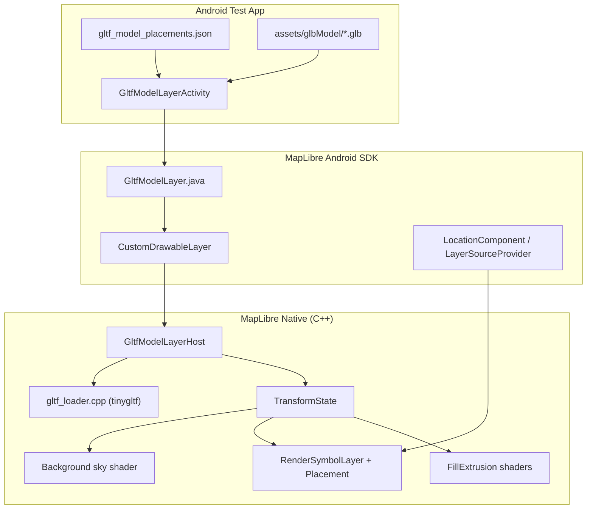

# MapLibre Native 3D — Project Accomplishments

This document summarizes the work done on this fork of **MapLibre Native**, focused on **Android 3D map rendering**: glTF/GLB models, horizon-aware camera math, sky rendering, fill-extrusion improvements, and navigation-puck fixes at high pitch and zoom.

---

## Table of Contents

1. [Executive Summary](#executive-summary)
2. [Development Timeline](#development-timeline)
3. [Core Native Features](#core-native-features)
4. [Android SDK Features](#android-sdk-features)
5. [Test App Usage Guide](#test-app-usage-guide)
6. [Building & Running the Android App](#building--running-the-android-app)
7. [Architecture Overview](#architecture-overview)
8. [Key Files Reference](#key-files-reference)
9. [Known Limitations & Future Work](#known-limitations--future-work)

---

## Executive Summary

This project extends MapLibre Native from a 2.5D vector map engine into a **3D-capable renderer** suitable for cinematic, high-tilt navigation views. Major accomplishments:

| Area | What was built |
|------|----------------|
| **3D Models** | Full glTF/GLB loading pipeline + `GltfModelLayer` Android API |
| **Horizon / Camera** | Increased FoV (0.95 rad), 70° max pitch, pitch-aware far-plane culling |
| **Sky** | Built-in sky band above the horizon when the map is pitched |
| **Buildings** | Soft bevel shading on fill-extrusion roofs; hide 2.5D extrusions where GLB models sit |
| **Symbols / Puck** | Fixed navigation puck sticking/disappearing at high zoom and moderate pitch |
| **Performance** | Host-scoped per-frame transform cache for GLB layers |
| **Test App** | Streamlined single-activity demo with JSON-driven model placements and explore menu |

---

## Development Timeline

Work progressed in three broad phases between March and May 2026.

### Phase 1 — glTF Foundation (Mar 2026)

- Load GLB models from Android assets (in-memory bytes); render multiple models on the map
- Hide 2.5D fill-extrusion buildings within 50 m of GLB POIs so models aren't occluded
- Automatic camera tour between models (zoom in, hold, zoom out, fly to next)
- **Simplified test app** — single launcher activity (`GltfModelLayerActivity`), removed ~140 unused demo activities
- **Explore 3D menu** — dropdown model picker, height-based zoom, per-model rotation/mirror from JSON
- Fixed GLB model orientation (rotation + mirror axes)
- Initial proof-of-concept: Duck.glb via `CustomDrawableLayer` / `GltfModelLayerHost`

### Phase 2 — Rendering Optimizations (Apr–May 2026)

- **Host-scoped frame cache** — precompute rotation/mirror/scale invariants; cache projection matrix per frame
- Increased max pitch/tilt to **70°** (`PITCH_MAX = π × 7/18`)
- Increased **FoV to 0.95 rad** for wider horizon view; distance clamping for culling
- **Sky layer** in background shader; horizon distance profile updates; symbol culling fixes
- Unified fill-extrusion + GLTF far plane; depth buffer fixes; models visible at all pitch angles
- **Navigation puck fix** — tile-corner distance culling + GeoJsonSource maxZoom 22
- **Soft bevel** fill-extrusion roof shading (bevel radius tuned 0.15 → 0.07)

### Phase 3 — Publication Cleanup (May 2026)

- Removed proprietary map styles, API keys, and landmark model assets
- Replaced demo with **Duck.glb** + **OpenFreeMap Liberty** public map style
- Fresh single-commit repository history for open-source release

---

## Core Native Features

### 1. glTF / GLB Model Rendering

**What it does:** Loads `.glb` / `.gltf` files and renders them as true 3D geometry on the map at a geographic coordinate.

**Implementation stack:**

```
GltfModelLayer (Java)
  └─ CustomDrawableLayer
       └─ GltfModelLayerHost (C++ JNI)
            └─ util::loadGltf / loadGltfFromMemory (tinygltf)
                 └─ CustomDrawableLayer::addGeometry()
```

**Capabilities:**
- Load from **file path** or **in-memory bytes** (Android assets)
- Per-model **scale**, **rotation** (X/Y/Z degrees), and **axis mirroring**
- Diffuse/base-color **texture** support
- Static triangle meshes (no animation, no PBR)
- Backend-agnostic via `CustomDrawableLayer` (OpenGL ES on Android)

**Key constants** (`include/mbgl/util/constants.hpp`):
- Models share the fill-extrusion horizon profile: `HORIZON_FILL_EXTRUSION_MIN_MULTIPLIER = 2.5`, `MAX = 12.0`

---

### 2. Horizon View — FoV, Pitch, and Far-Plane Culling

**Problem solved:** At steep pitch angles, the default MapLibre camera felt too narrow and distant content was culled incorrectly, causing 3D models and symbols to pop out of view.

**Changes:**

| Constant | Old | New |
|----------|-----|-----|
| `DEFAULT_FOV` | ~0.64 rad (~37°) | **0.95 rad (~54°)** |
| `PITCH_MAX` | 60° | **70°** |
| `HorizonDistanceProfile::Model` | Separate 500–2000× multiplier | **Removed** — models use fill-extrusion profile |

**How it works:**
- `TransformState::getProjMatrix()` computes a pitch-aware far plane via `computeHorizonFurthestDistance()`
- Two profiles: `Default` (tiles/labels) and `FillExtrusion` (buildings + GLB models)
- `getEffectiveHorizonCullMultiplier()` drives tile and symbol distance culling

---

### 3. Sky Layer

**What it does:** When the map is pitched, the area above the horizon renders as a solid sky-blue color instead of showing empty/background tiles.

**Implementation:**
- `TransformState::getHorizonClipY()` — projects the top-center viewport point to clip space
- `shaders/background.fragment.glsl` — compares screen NDC Y against horizon clip Y
- Default sky color: CSS `skyblue` (`135, 206, 235`)
- Style-spec properties added: `background-sky-top-color`, `background-sky-bottom-color`

---

### 4. Fill-Extrusion Soft Bevel Shading

**What it does:** Adds fake bevel/soft edges to 3D building roofs so extrusions look less blocky at cinematic tilt angles.

**Implementation:**
- Vertex shader passes edge distance, height, and normal to fragment shader
- Fragment shader blends roof normals toward up-vector near edges (`FILL_EXTRUSION_BEVEL_RADIUS = 0.07`)
- Full lighting model: directional light, vertical gradient on walls, opacity

**Touched files:** `shaders/fill_extrusion.{vertex,fragment}.glsl`, all backend shader variants (GL, Metal, Vulkan, WebGPU)

---

### 5. Symbol & Navigation Puck Fixes

**Problem:** At zoom > 16 with moderate pitch, the location puck would **stick** at a stale screen position or **disappear** until the user panned/zoomed.

**Root cause:** The LocationComponent GeoJSON source used `maxZoom=16`. When overzoomed, a single source tile spans a huge world area. Tile culling used the **geometric tile center**, which could be far from the visible puck along the camera-forward axis. Culled tiles skipped GPU vertex uploads, leaving stale drawable data.

**Fix (two parts):**

1. **Android** — `LayerSourceProvider`: bump GeoJsonSource `maxZoom` from 16 → **22**
2. **Native** — `TransformState::getNearestCameraToTileDistance()`: project all **4 tile corners** and use the nearest in-front distance
3. **Native** — `RenderSymbolLayer`: use nearest-corner distance for tile culling
4. **Native** — `Placement::updateBucketDynamicVertices`: dedicated path for point symbols at pitch ≥ 0.01; hide only behind camera or above horizon (not padded viewport bounds); don't skip fade-in symbols

---

### 6. Host-Scoped Frame Cache (GLB Performance)

**What it does:** Avoids recomputing rotation matrices, mirror scales, and projection transforms on every mesh draw call.

**How:**
- `TransformInvariants` computed once in the host constructor (rotation rad, mirror signs, earth circumference at lat)
- Per-frame `FrameCache` keyed on `params.frameCount` caches `xyScale` and `nearClippedProjectionTranslated`

---

## Android SDK Features

### `GltfModelLayer`

Public API in `org.maplibre.android.style.layers.GltfModelLayer`:

```java
// From assets (recommended)
byte[] data = getAssets().open("glbModel/Duck.glb").readAllBytes();
GltfModelLayer layer = new GltfModelLayer(
    "my-model",
    data,
    new LatLng(37.7749, -122.4194),
    0.001f,          // scale
    90f, 0f, 0f,     // rotationX, rotationY, rotationZ
    false, false, false  // mirrorX, mirrorY, mirrorZ
);
style.addLayer(layer);
```

Constructors also accept a file path on device storage.

### `BuildingExtrusionSnapshot`

Helpers for adding fill-extrusion building layers to `MapSnapshotter` styles, with viewport GeoJSON filtering (`GeoJsonViewportFilter`).

---

## Test App Usage Guide

The **MapLibreAndroidTestApp** launches directly into `GltfModelLayerActivity` — a focused 3D model explorer.

### UI Features

- **Map view** — full screen, no logo/attribution bar
- **Explore 3D Models menu** (top-left) — dropdown to pick a model and fly the camera to it
- **Camera transitions** — zoom out → fly → zoom in when switching models; layers hidden during flight for smoothness

### Adding Your Own Models

1. Place `.glb` files in:
   ```
   platform/android/MapLibreAndroidTestApp/src/main/assets/glbModel/
   ```

2. Edit `assets/gltf_model_placements.json`:

```json
[
  {
    "id": "MyBuilding",
    "displayName": "My Building",
    "asset": "glbModel/MyBuilding.glb",
    "lat": 37.7749,
    "lng": -122.4194,
    "heightMeters": 25,
    "scale": 1.0,
    "rotationX": 90,
    "rotationY": 0,
    "rotationZ": 0,
    "mirrorX": false,
    "mirrorY": false,
    "mirrorZ": false
  }
]
```

| Field | Purpose |
|-------|---------|
| `id` | Unique key; used as layer id suffix |
| `displayName` | Label in the explore dropdown |
| `asset` | Path relative to `assets/` |
| `lat` / `lng` | WGS84 coordinates |
| `heightMeters` | Used to compute camera zoom (taller → zoom out slightly) |
| `scale` | Model scale factor (Duck demo uses `0.001`) |
| `rotationX/Y/Z` | Degrees; X=90 is typical for Y-up glTF models |
| `mirrorX/Y/Z` | Flip model on an axis before rotation |

3. Rebuild and run — no Kotlin changes needed.

### Hiding 2.5D Buildings at Model Locations

The activity automatically applies a **50 m radius exclusion filter** on fill-extrusion building layers (`building-3d`, `3d-buildings`, etc.) so GLB models aren't hidden behind extruded footprints.

### Map Style

The test app uses **OpenFreeMap Liberty** (`TestStyles.OPENFREEMAP_LIBERTY`) — a free, public vector style. Alternatives in `TestStyles.kt`:

- `DEMOTILES` — MapLibre demo tiles
- `OPENFREEMAP_BRIGHT`
- `AMERICANA`
- Protomaps variants (requires API key)

### Demo Model

The repo ships with **`Duck.glb`** — the original proof-of-concept model — placed in San Francisco. Scale is `0.001` because the model is authored in meter-scale coordinates.

---

## Building & Running the Android App

### Prerequisites

- Android Studio (recent version)
- Android NDK (configured in project)
- JDK 17+

### Build steps

```bash
cd platform/android
./gradlew :MapLibreAndroidTestApp:assembleDebug
```

Install on device/emulator:

```bash
adb install MapLibreAndroidTestApp/build/outputs/apk/debug/MapLibreAndroidTestApp-debug.apk
```

Or open `platform/android` in Android Studio and run the **MapLibreAndroidTestApp** configuration.

### Using a custom GLB via adb (alternative to assets)

```bash
adb push MyModel.glb /data/local/tmp/MyModel.glb
```

Then create a layer with the file path constructor in code (see `GltfModelLayer` Javadoc).

---

## Architecture Overview



### Data flow for one frame (GLB model)

1. `GltfModelLayerActivity` reads JSON → creates `GltfModelLayer` per placement
2. JNI creates `GltfModelLayerHost` with bytes + lat/lng + transform params
3. `initialize()` parses GLB via tinygltf → meshes + optional texture
4. Each frame, `update()` calls `addGeometry()` for each mesh
5. `GeometryTweakerCallback` projects lat/lng to world pixels, applies scale/rotation/mirror, multiplies by near-clipped projection matrix
6. Renderer draws with fill-extrusion horizon profile (correct depth at high pitch)

---

## Key Files Reference

### Native core

| File | Role |
|------|------|
| `src/mbgl/util/gltf_loader.cpp` | glTF/GLB parsing (tinygltf) |
| `src/mbgl/map/transform_state.cpp` | Camera, horizon, far plane, `getHorizonClipY`, `getNearestCameraToTileDistance` |
| `include/mbgl/util/constants.hpp` | FoV, pitch max, sky colors, horizon multipliers, bevel radius |
| `shaders/background.fragment.glsl` | Sky rendering above horizon |
| `shaders/fill_extrusion.fragment.glsl` | Soft bevel + lighting |
| `src/mbgl/text/placement.cpp` | Point symbol horizon culling at pitch |
| `src/mbgl/renderer/layers/render_symbol_layer.cpp` | Tile-level nearest-corner culling |

### Android

| File | Role |
|------|------|
| `platform/android/.../GltfModelLayer.java` | Public Java API |
| `platform/android/.../gltf_model_layer_host.cpp` | Native host + frame cache |
| `platform/android/.../LayerSourceProvider.java` | Puck source maxZoom fix |
| `platform/android/.../GltfModelLayerActivity.kt` | Test app demo |
| `platform/android/.../gltf_model_placements.json` | Model placement config |

### Documentation

| File | Role |
|------|------|
| `ACCOMPLISHMENTS.md` | Feature overview, usage guide, and architecture reference |
| `README.md` | Quick start and build instructions |

---

## Known Limitations & Future Work

| Item | Status |
|------|--------|
| Navigation puck at extreme pitch | Fixed; verify on target devices |
| glTF animations / PBR materials | Not supported — static meshes + diffuse texture only |
| Flutter plugin | Not included in this release — Android SDK only |
| Symbol culling at extreme distances | Some symbols may still render outside ideal cull bounds at extreme distances |
| Per-model scale in JSON | Supported in test app; not yet in style-spec layer properties |
| iOS / macOS GltfModelLayer | Core loader exists; no platform wrapper yet |

---

## Publication Notes

The following was removed before open-source release:

- Proprietary map styles and embedded API keys
- Third-party landmark GLB models and internal route coordinate files
- Legacy app branding and credentials

The public demo uses **Duck.glb** + **OpenFreeMap Liberty** style.

---

*Last updated: May 2026.*
