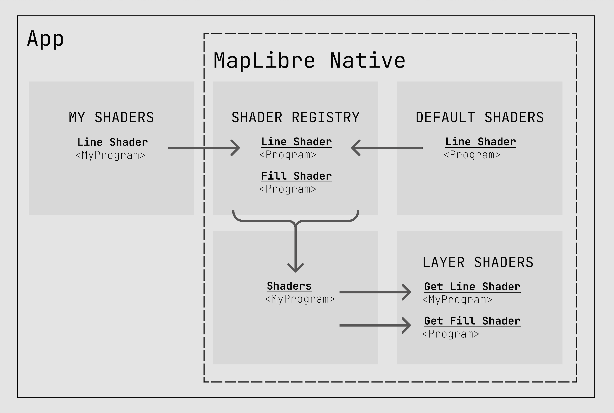
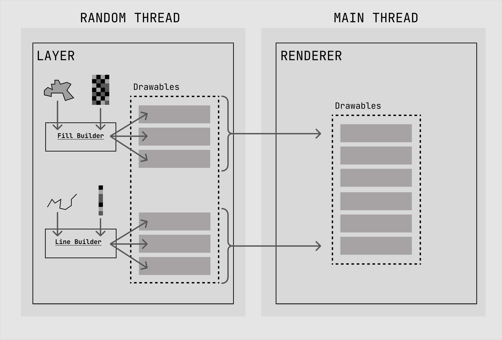

# MapLibre Rendering Modularization Design Proposal

Before we dive in, a bit about our process.  Stamen Design, with a sub-contract to Wet Dog Weather, has been contracted by Amazon (AWS) to develop two proposals to upgrade MapLibre Native.  The goal is Metal support and the first proposal is this one: Modularizing the rendering support.

We started with a sparse proposal, laying out the goals first.  Our intent was to let the MapLibre community add their own feedback and discussion.  We have finished our update to the PR and now look for more formal feedback on the way to adoption of the design.

The mechanism for this will be a Pull Request, which we have obviously opened.  This will result in as much discussion as the community would like here, on the OSM Slack and by email or video call (we're available, so reach out).  As we wrap up our specific proposal, that discussion will hopefully reach a consensus and we'll be ready for a Yes or No on the PR by the 21st of November.

Then we do it again for Metal.

## Motivation

MapLibre Native is currently depending on a deprecated rendering SDK (OpenGL) for iOS. It needs to move to Metal for iOS in some form. Moreover, there are other graphics SDKs to consider, like Vulkan for Android or Direct3D for Windows. Metal is an existential crisis on iOS, the others are desired but not required.

Thus the graphics implementations must diverge, either by doing so within MapLibre Native or depending on another toolkit to do the rendering entirely. We are proposing the former approach, with support for multiple rendering SDKs in the MapLibre Native toolkit itself.

This is the MapLibre Rendering Modularization Design Plan and the biggest goal is to pave the way for Metal support on iOS. But while we’ve got the hood open, so to speak, we’d also like to fix a few other things. So let’s get to it!

But before that, a quick note on terminology.
- "toolkit" usually refers to MapLibre Native, but may also be used in context for another project at a similar level.
- "SDK" or Software Development Kit usually refers to the rendering library, like OpenGL or Metal, at least in this document.
- "API" refers to an Application Programming Interface.  In this context it refers to the classes and methods made available to a developer.
- "Snapshot" refers to taking a picture of the active display buffer at a specific time.
- "Direct" and "indirect" rendering refer to modes of rendering common to a number of graphics toolkits, but we're using the Metal definition here.  Direct rendering is when the developer constructs commands on the main thread in real time.  Indirect rendering is when they construct more of that off the main thread or ahead of time.

## Goals

It is useful to split our goals into three sections to articulate what this proposal aims to accomplish:

- **North Stars:** These guide the overall direction of the proposal, and are the overarching _why_.

-  **Library refactors:** These are concrete changes we are proposing to the library to get to our North Stars.

- **Evaluation metrics:** These are specific criteria we will accomplish through this proposal.

### <a name="north-stars">North Stars</a>

1. This refactor will allow migration to Metal on iOS with less overhead than a migration without this explicit modularization. In other words, migration will be substantially simplified.
2. It should be possible for a developer familiar with the platform to modify visual rendering more easily than before.

### <a name="core">Core Functionality</a>

1. Shader (program) code will be implemented in a modular fashion, such that replacement of any given shader can happen without impacting other shaders.
2. Shader (program) code may no longer be compiled from the [webgl source](https://github.com/maplibre/maplibre-gl-js/tree/main/src/shaders), and should be organized within the maplibre-native repo (as a compile time option).
3. Layer rendering logic should be replaceable at the dev level.  All the necessary support should be exposed and a developer should be able to take over representation of any given layer.
4. Developers should be able to associate specific styles with specific layer rendering.  The style sheet should be able to call out the type of representation it would like beyond the default.
5. Developers should be able to add new visual representations fed by existing geometry types.  Such as data display driven by tile sets or animated markers.
6. We should be able to drop out unused layer types with a compile flag.

###  <a name="eval">Evaluation Metrics</a>

1. Developers should be able to continue using the OpenGL renderer with this refactor.
2. The resulting binary from the modularized refactor should not increase more than 5% when compiled.
3. The modularization refactor should be visually identical to the current implementation when using OpenGL. All existing render tests should pass, and developers that continue to use this library with an OpenGL renderer should not experience any visual degradation such as artifacts.
4. After refactor, the startup time for applications built with this library should not increase. This will be measured by the startup time of [this](https://github.com/maplibre/maplibre-native/blob/main/platform/ios/platform/ios/iosapp%20UITests/iosapp_UITests.swift) iOS test app.
5. When implemented with a given style and set of tilesets, the compiled library should not decrease the rendering frame rate.
6. This refactor will not introduce data loading or other bottlenecks that will negatively impact rendering performance.
7. Developers currently using this library will not see any breaking API changes, and will be able to seamlessly upgrade versions.
8. The library should continue to work on architectures and platforms it currently works on.

## Proposed Change

### Shader(Program) Representation

_Addresses core functionality [#1](#core) and [#2](#core)._

We need an external representation for programs (shaders) so they can be added or replaced by developers.

Internally to the toolkit shaders are called Programs, but that's far too confusing at this level.  Are we referring to a GPU program or a program the user writes?  Best to stick with the term shader.

The shaders need a representation visible outside the toolkit and we need to change the way they’re handled inside the toolkit.  We need to be able to replace them, add brand new ones, and allow developers to control their shaders.

#### The way it is now

Individual shaders are represented by an object class with massive amounts of template logic and a minimum of in-line comments.  They’re opaque from the outside and only controllable through vector tile data and styles.

The [render_raster_layer](https://github.com/maplibre/maplibre-native/blob/main/src/mbgl/renderer/layers/render_raster_layer.cpp), as an example, asks for the instantiation of (eventually) RasterProgram.  Rather than having the source for the program, that then pokes into a compressed chunk of memory that contains the source, which is then uncompressed and fed into OpenGL for compilation.

All of this makes sense in context, but is completely inaccessible outside the toolkit and rather incomprehensible when making changes.

#### Required changes
To let developers control their own shaders we’ll need to:
- Allow shaders to be instantiated with shader source (one option).
- Allow shaders to be instantiated by reference to unique names in pre-compiled file (Metal does this).
- Set uniform values by name
- Set uniform structs by name (Metal uses structs)
- Tear down the specific shader (Program) definitions and replace them with one generic one.  This is almost the case now, with much of the key functionality being near the top of the class hierarchy.
- Support for pure calculation shaders.  Useful for a variety of things, but think particles.

#### Benefits
We'll be able to:
- Create entirely new shaders to do new and different things.
- Replace existing shaders without having to recompile the whole set.
- Let developers communicate with their own shaders.

#### For GLES we’ll need to:
- Push aside the existing Program hierarchy and rename it with a GLES extension.
- Allow for named uniforms for new Programs.
We can probably ignore that requirement for the existing shaders and just wrap them

### Shader(Program) Registry

_Addresses core functionality [#1](#core) and [#2](#core)._

Once developers can create their own shaders, we’ll need a way of managing them, thus the Shader Registry.  This registry will associate a given shader (Program) with a name.  Basic functionality will include:
- Add a new shader by name
- Replace an existing shader by name
- Query a shader by name
- Publish the well known names of the core shaders for the basic functionality

Layers already go through a level of indirection to instantiate or reference their associated programs.  The shader registry could be inserted into that get*LayerPrograms() pattern fairly easily.

The GLES version of the Shader Registry can encapsulate the simple (but fairly weird) logic of shader source lookup that exists now.

#### The way it is now

The layers more or less pull their shaders out of a compressed block of text.  Clever, but difficult to access.

#### Required Changes

We'll need to make a Shader Registry class, of course, but that's fairly simple.  It should be thread safe, but you're mostly going to be using it on the main thread.

The layers should pull their shaders out of the shader registry on demand.  This will give developers a chance to replace or add shaders before they're needed.

### Rendering Passes

_Addresses core functionality [#5](#core)._

Modern graphics pipelines use more than one pass to create a visual representation.  It's actually pretty unusual to have a single rendering pass in your toolkit.  These are used for a dizzying array of purposes, including lightning effects, shadows, atmosphere and many others.  We (Wet Dog Weather) use separate rendering passes to draw data intermingled with map elements.

Without getting too deep into specifics, early rendering passes allow the developer to use the power of the rasterizer for their own data.  Later rendering passes are typically used to decorate the map with effects.

#### The way it is now:
The [low level rendering logic](https://github.com/maplibre/maplibre-native/blob/main/src/mbgl/renderer/renderer_impl.cpp) in the toolkit seems to only support one explicit rendering pass.

However, there is the [RenderPass](https://github.com/maplibre/maplibre-native/blob/main/src/mbgl/gl/render_pass.hpp) so some notion of this exists in the toolkit, but it's not clear how complete that is.  It may depend on ordering to work things out, rather than the explicit command buffer filling and fences we would use in a more modern approach.

In any case, we need this filled out more explicitly for the render targets.

#### Required changes
To flexibly implement multiple rendering passes we will need to:
- Keep track of them by name and order
- Implement Render Targets (see below)
- Outputs from one pass as inputs to another
- Optimize out passes without geometry
- Expose all of this outside the toolkit

#### Benefits
Similar to what was discussed above:
- Using the rasterizer to sort out your data ahead of time.  We do this a lot with weather data.
- Reducing the size of a very costly shader.  The bigger your shader, the longer it takes.  If you have some fancy effect, it can probably be rendered at lower resolution and then laid over the top of the final scene.
- Doing post-process effects on the map.  In games you might think of lens warping, wipes, and such.  For mapping, this tends to be more merging data layers or things like glow.

### Off Screen Render Targets

_Addresses core functionality [#5](#core)._

The toolkit already has support for one offscreen render target.  You can either set things up “normally” where the toolkit draws to a window or you can set things up to draw to memory and it will hand you back the resulting image.  This is a little like that, but in real time.

Having an explicit off screen render target lets the developer do something like a snapshot in real time.  That is, run some sort of logic on the data being rendered before it gets its final visual representation.

#### Required Changes
To support Rendering Passes we’ll need Render Targets we can access in a way similar to a texture.  They’ll be set up with:
- Settings such as bit depth and width/height (you don’t always want full screen resolution)
- Allowing geometry to specify which one(s) they’ll render to as a “target”
- Query and snapshot

This may seem a bit of a detour, but it’s fairly easy to get the basics of it in place and allow for further development as developers might add new shaders and varieties of targets.

#### Benefits
It's a core idea in many rendering toolkits, but for MapLibre Native it will let us:
- Reach into the rendering pipeline to make use of processed data without adding a GPU<->CPU round trip.
- Make it easier to assemble things like videos in real time.
- Help define how the rendering passes work with fixed points of output.

### Snapshotting

When you take a snapshot of the map, the toolkit will return an image to you.  This works well for OpenGL, but not as well for other SDKs.  What we really need to do is provide a callback and copy the buffer after it's finished drawing.

For OpenGL this will be about the same.  For other SDKs this can be much more efficient.

#### Required Changes

The snapshot method will need to take a callback and notify it when a snapshot is ready.
We may also want to expand this out to get multiple snapshots, or at least allow for that in the future.

#### Benefits

For non-GL SDKs:
- The caller won't be interrupting the rendering flow and forcing it to come to a stop.
- If implemented efficiently, the caller could get multiple frames at very high speed.  Perhaps high enough speed to encode video.

### Drawables and Builders

_Addresses core functionality [#3](#core), [#4](#core), and [#5](#core)._

These are concepts we're bringing over from WhirlyGlobe-Maply, but you can find references to Drawables as far back as SGI's Performer SceneGraph, probably earlier.

The purpose of a Drawable is to encapsulate all the information needed to draw a set of low level objects of the same type.  For instance, a screen full of text (triangles with reference to a texture atlas and shader) or a single (or even multiple) tiles of geometry (triangles with a reference to a texture and shader).

In WhirlyGlobe we’ve always called out separate objects for drawing certain kinds of data.  We had a base class Drawable and then subclasses for things like Particles and such.  But what we found, particularly with the move to Metal is that all our front line rendering classes started looking the same.  Thus we’re down to BasicDrawable and BasicDrawableInstance.  If we had some free time we’d combine those two and let the buffers they use have a stronger definition and be shareable.

Which is to say that Drawable is a good concept which can encapsulate a lot of complexity.  So much so that it eventually encapsulates ALL the complexity, at least at that level of rendering.  It’s a good interface between the things that construct geometry and the things that render geometry.

To keep the Drawable somewhat manageable, we added the concept of a Drawable Builder.  This is an object that you throw geometry at in a somewhat disordered way and it emits Drawables when you’re done.  MapLibre's [Buckets](https://github.com/maplibre/maplibre-native/blob/main/src/mbgl/renderer/bucket.hpp) are similar, but not quite the same.  Perhaps they'll be adaptable.  We'll see.

Drawables and Builders have a subclass for each supported rendering SDK.  One mistake we won’t bring over is using multiple inheritance for that.  You’re welcome.

It’s kind of obvious why you’d have a subclass of Drawable for each SDK.  You want to let the SDK represent data the way it wants (interleaved or not, 16 bit or 32 bit floats, all sorts of things), but it’s less obvious why the Builders need one subclass per SDK.

Builders are actually doing the most specific SDK related work.  For OpenGL you build up fairly simple arrays of data, which MapLibre has good support for.  But for Metal, you can (and should) allocate space off a shared heap and put the data in there.  Each of these ends up looking fairly different and the way you wire things up at the low level is very different.  So Builders are very specific and let us hide all that.

Builders will be used primarily by Layers to emit Drawables for rendering.

#### The way it is now:

This is a big topic because it gets to the very heart of the critical changes we want to make to the toolkit.  There are a couple of different categories that are revealing and we'll use some examples.

Most commonly there are *render layers*.  These are individual classes that know how to render, for instance, the [fill layer](https://github.com/maplibre/maplibre-native/blob/main/src/mbgl/renderer/layers/render_fill_layer.cpp).  You'll see a bunch of these that start with "render" and end with "layer".

What's going on here is that the toolkit has broken out a bunch of features from a tile, consolidated them together in a Bucket and then handed them off to a Layer to render.  Sure enough, if you look in the render_*_layer you can see it doing just that.

Now it's not redoing the work of consolidation each frame, but it is doing a lot and a lot that is very specific to what the layer wants.  This leads to a few interesting issues.
- That's a lot of commands that are fairly similar in every render layer.  Not a tiny amount of duplication there.
- This is more specific logic than we'd want to see in a rendering loop.  Remember, this runs every frame.
- If your data is not in tile form, it's going to be hard to render.

That last one is really interesting and we can find an example in MapLibre Native itself.  Look to the [Render Location Indicator Layer](https://github.com/maplibre/maplibre-native/blob/main/src/mbgl/renderer/layers/render_location_indicator_layer.cpp).  Here's where this approach trips up... rolls down the hill... into a pile of broken glass.  You can feel the developers' pain in this module.

If you're not familiar with real time rendering toolkits, I'll put it this way.  Managing the logic for a location puck that updates every time the user moves should not involve direct OpenGL calls.  It should be abstracted, at least a little.

Now the toolkit does have some help for assembling the necessary buffers and such, but there's raw OpenGL calls in the module, careful management of assets and just generally pain.  It shouldn't be this difficult to draw a location puck.  Imagine trying to do this outside of the toolkit.

#### Required Changes

We'd like to make that location puck example easier, we'd like to make it possible to do similar things outside of the toolkit source, and we'd like to consolidate all of those render layers into some more generic classes.  Here's how.

A new Builder class that will have methods like this:
- Set shader by unique handle (possibly name)
- Add a new attribute array of a given type and handle (a string name for OpenGL)
- Add an entry to a given attribute array (e.g. a normal or vertex or color or something only the shader knows)
- Set a uniform of a given type and handle.
    Perhaps just for OpenGL.
- Add a new uniform struct of a given handle.
    Metal doesn’t really do the single named uniform thing like OpenGL does.  It’s better and more efficient to hand over a full struct.
- Get the list of Drawables that represent everything we’ve built up to this point.
- Set the emitted drawables up for toolkit specific requests like transitions.

Each SDK will need its own subclass of Builder.

The shared Drawable super-class would contain core functionality across all platforms.  Some of this will be related to things like transitions and tracking tile logic.  Some may be related to data controlled rendering, but more on that later.

In any case the Drawable acts as a basic container that is handed around between the parts of the system that build things and the part that renders things.

Each SDK specific Drawable subclass will do things like:
- Upload/Bind their data to the SDK.
    Ideally this can happen on non-rendering threads, but you never know.
    This includes figuring out what the shader is asking for and providing it, or convincing defaults.  The way MapLibre Native does this now is a bit static, with templates.  Clever, but perhaps too clever.  It’s okay to wire things up dynamically.
- Draw directly.
    OpenGL is big on this.  You have to set things up, draw, then tear them down.
    It has the virtue of being simple.  If you’re making changes, you just do them directly.
- Draw indirectly.
    Metal does this.  You add your data to a command buffer where it may be drawn for many frames.
    This is the fastest and best way to do things, but there are updates you must make between frames.  Obviously, the overall map state needs to be updated, otherwise you’re just redrawing in the same way each time.  Sometimes Drawable specific state changes too and data driven rendering will come into play here.
- Update for frame.
    If you’re drawing indirectly, this is all the state that must be changed for a given frame.
    Some of this is shared, like the map state (e.g. the matrix controlling positioning, lighting and so forth).
    Some can be specific to a particular Drawable.  Data driven visuals may fall into this category depending on what the data is. 
    Just to make this even more fun, modern renderers are going to have multiple frames in flight at any given time.  So you can’t just keep one set of values and update them periodically.  My preferred approach is to put memory copy commands into a command buffer with guard logic between them.  In Metal, anyway.  Vulkan will have its own way to do that and OpenGL just doesn't.  Well, there's probably an extension somewhere that does, but it's very hard to use and sparsely supported.
- Tear down their data.
    Pretty simple for OpenGL, but with Metal when you’re using heaps (and you should) you actually want another thread to do this.  Thus it’s SDK specific.

Now there is already logic to do a lot of this spread throughout various classes in MapLibre Native.  Buckets have some of it, Programs actually own the draw() method, and so forth.  To switch to this approach we'll need to cut across the gl and gfx levels of the toolkit, even a bit higher, to capture everything that builds geometry.  We'll need to convert that over to this approach and make sure we didn't miss anything, like all the fiddly per-program state.

#### Benefits

Switching to a Drawable/Builder approach helps consolidate the rendering SDK specific logic in a smaller number of places.  OpenGL state is notoriously picky, Metal is less so still but still complex.  This is a case where making general purpose uber-classes is actually the right choice.

We can make things like the location puck simpler.  If we can expose much of this outside the toolkit we may even make it possible to do things like your own location puck, or similar functionality.

By moving to this approach we can let the rendering logic deal only with its own classes.  Rather than letting implementation propagate all the way down to the render_*_layer, which has to very specifically implement them, we can make layers ask for what they need and let the SDK level implement it however it may feel like.  This is particularly important for Metal's indirect mode.

### Atlases: Line, Image, Pattern, and Glyph

_Addresses core functionality [#3](#core)._

Having a lot of little textures floating around is inefficient.  This was very much the case in OpenGL, but it's still true in Metal and other SDKs.  There's a long conversation to be had about that, but it's somewhat moot.  MapLibre Native uses atlases, so we need to consider them.

All of these atlases are essentially Texture Atlases.  That is, a group of individual textures gathered together for efficiency.  Shaders reference these with a little offset into a larger texture.  The shaders may not even be aware of it.

#### The way it is now

Right now each of the atlas types has a reference within the render loop (discussed below).  They also seem to do their image uploading on the rendering thread.  That's unnecessary even in OpenGL, but it is simple.

#### Required Changes

The rendering loop shouldn't need to know about any of the atlases. That bookkeeping is better done as a callback.  That would open up the possibility of doing more atlas types in the future.

Further, the atlases should try to do their data uploading on other threads.  If you're doing this with OpenGL you need to open shared contexts and admittedly, it can get a bit complex.  With Metal it's much simpler.

Much of this could be done with expanded observers as discussed below.

#### Benefits

Less work done in the rendering loop is always better.  More CPU available for UI developers to update the curves on their buttons.

Making the atlas updates more generic might allow for new types, or even the fabled Dynamic Texture Atlas.  We have one in WhirlyGlobe-Maply and it's great for adding random geometry and textures into the mix.  But that's outside the scope of this proposal.

### Main Render Loops

_Addresses refactoring that make migration easier, particularly our [north stars](#north-stars)._

Every real time rendering toolkit has a main rendering loop or something like it.  It's not actually a loop anymore, it's a callback.  Years ago there actually was a main rendering loop where the program in question would draw a frame, wait for a defined period and then draw another frame.  With modern OS' and the rise of modern UI toolkits, that loop has been replaced by time or event based callbacks.  We will still sometimes refer to it as a "rendering loop", however.

On iOS this runs on the main thread and on Android this runs on its own separate thread.  You might think the latter is better, but it has its own problems (gesture lag).  In any case, MapLibre Native handles both just fine.

The toolkit's main rendering "loop" lives in [renderer_impl](https://github.com/maplibre/maplibre-native/blob/main/src/mbgl/renderer/renderer_impl.cpp) and it's worth a look.  It serves as a central point to begin examining the real time rendering.

As you might suspect, the rendering loop logic and implementation are heavily influenced by OpenGL.

#### The way it is now

Since to toolkit supports one rendering SDK, OpenGL ES, there is only one rendering "loop" and it focuses on having Layers render themselves.

#### Required Changes

The most obvious change is we'll need one renderer_impl per rendering SDK.  We can follow the backend/renderer logic to implement that for OpenGL with just a bit of tweaking and then open it up for Metal and Vulkan.

The GL renderer_impl itself should change in the following ways:
- Implementation of more general render passes as described above
- Move the specific atlas logic out as described above
- Restructuring around the Drawables based approach

In general, the changes should make the OpenGL renderer "loop" more generic and less focused on the specifics of various objects.

#### Benefits

On iOS the time taken to render features is time not spent on updating the main UI or whatever the developer forgot to move to another thread.  Less work in the renderer means more time to do that work.  On Android the renderer runs on a separate thread, but the amount of time taken affects the frame rate and power usage.  It's still worth optimizing.

As GPUs get bigger, we want them to take over more of the workload.  That means handing more responsibility over to that part of the system and doing the setup/teardown and control on other threads or much more quickly on the main thread.  Metal is structured around this and we'll discuss it more in the next PR.  Vulkan is structured along similar lines.

These changes will allow us to go in very different directions between OpenGL and Metal.

### Renderer Observer

_Addresses refactoring that make migration easier, particularly our [north stars](#north-stars)._

The observer classes in MapLibre Native let the developer know when something has happened or is about to happen.  The class for the Renderer mostly just lets the developer know:
- About the renderer starting and stopping
- When an individual frame is begun and finished

That structure is just fine, but we should lean into it and go deeper.

#### The way it is now

At present we get a handful of events related to high level rendering stages.  These include a frame start/stop and rendering start/stop events.

#### Required Changes

For the main class we should consider adding events for each rendering pass.  We don't want to get down to the level of the new Drawables, but a bit more flexibility would make adding features easier.

We do want to make Renderer Observers specific to each SDK.  Then we'll want to publish SDK specific events.  For OpenGL this isn't going to be terribly different, but for Metal or Vulkan it can get more granular.

We could go all the way and just publish events on everything even down to the level of Drawable's being drawn.  That's a specific implementation decision left up to the developers.  There are performance implications.

#### Benefits

By opening up access to some of the low level rendering events and objects we would make it easier to add new functionality or pull in functionality from other toolkits.

An example might be Apple's Metal based image processing.  Much of that works in real time and produces Metal textures which can be reused directly, rather than going through a GPU->CPU->GPU copy cycle.

Another example is new functionality.  Rather than having to hack the toolkit itself, if we provide enough callbacks, developers can work on new functionality entirely outside MapLibre Native and then merge it in later if it seems important enough.  Ideally we could use that ourselves for features we may not need in a particular app, like heat maps.

### Optimization

_Addresses evaluation metrics [#2](#eval), [#4](#eval), [#5](#eval), and [#6](#eval)._

A number of our goals are related to improving the performance of the toolkit or at least not making it much worse.  I'd propose that we try not to make it worse at all and even improve it in a few areas if the opportunity arises.

For this PR let's restrict that to areas where we're likely to have made it worse and need to improve something to compensate.  For example, if we make the toolkit larger, we should try to make it smaller in another way.  If we make it slower, we'll try to make it faster to compensate.

Before taking any action, the developers should generate a report on the three key areas:
- Did the toolkit get larger on iOS or Android?
- Did the frame rate go down on either platform?
- Is the toolkit taking longer to startup on either platform?

If the answer to any of these questions is 'yes', then we move to the next stage.

#### Required Changes

These are contingent on what we may have made worse and why.  Opportunities to improve that specific situation will be strategic and hard to pin down at this point.  A lot depends on why the toolkit is bigger, slower, etc...  So this is speculation right now.

It depends on the other changes, but let's break it down by type.
- Is the toolkit slower to render?  Look at the frame logic and do more up front or on other threads.
- Is the toolkit slower to startup?  Figure out why and consider doing more work on separate threads or later.
- Is the toolkit bigger?  Look at slicing unused layers out with compile flags, getting rid of unused code or dependencies.

#### Benefits

The main benefit is just keeping the performance the same.  When we implement Metal on iOS we can expect rendering performance to get much better, of course, but that's not the goal of this effort.  We aim to not make it any worse while reaching our other goals.

While we're doing that, we may run across areas for improvement.  I'd suggest that the developers write these up as they find them.  Some obvious improvements are:
- Slicing out unused functionality
- Making more specific functionality optional
- Reducing or eliminating dependencies on third party libraries.

There's a lot that could be done in general and I'd encourage sponsors to pay maintainers to look into those.

## API Modifications

At present we do not expect to change any existing APIs at the public level.  We do expect to add some new API methods and classes.  We would detail these as we proceeded with the implementation.

## Migration Plan and Compatibility

We do not intend for these changes to be incompatible with the existing version.

## Rejected Alternatives

The main alternative would be switching to an intermediate toolkit to implement both OpenGL and Metal.  The problem with that approach is toolkit size.  Quite a few users cannot abide with the toolkit growing considerably.

## Pull Request Schedule

At the request of the community we've put together a list of Pull Requests that we would organize the work into.  These would be individual pieces that would leave the toolkit in working shape and set us up for the next PR.

#### PR 1: Shaders

This PR will address shader flexibility.

Sections covered:
* Shader Representation Changes
* Shader Registry

By the end we should have:
* Shaders called out as individual objects accessible outside the toolkit
* Shaders create-able from outside the toolkit
* Shaders replaceable from outside the toolkit
* A compile time option to use shaders either from the compressed source (as now) or with individual shader source files

Tests:
* Create a shader
* Get an existing shader
* Replace an existing shader

#### PR 2: Rendering Passes

This PR will add (or restructure) render passes for off and on-screen rendering.

Sections covered:
* Rendering Passes
* Off Screen Render Targets
* Snapshotting

By the end we should have:
* A snapshot callback for one or more frames
* The ability to render specific features to specific render targets
* Off screen render targets that can be read or reused for display

Tests:
* Create an off screen render target
* Direct a set of features to an off screen render target
* Snapshot callback example

#### PR 3: Drawables and Builders

This is the main part of the implementation.  We'll want to shift over to this rendering approach to consolidate the OpenGL portions into a small set of modules that will be easier to duplicate for Metal and other future SDKs.

Sections covered:
* Drawables and Builders

By the end we should have:
* Eliminated the render_layer variants
* Have the layers use Builders to generate Drawables
* Manage and use Drawables in the rendering loop for OpenGL

Tests:
* Output should look the same, or very close.  Use existing render tests.
* Frame rate shouldn't be any lower
* Toolkit shouldn't be any bigger

#### PR 4: Render Loops and Observers

This PR counts as a bit of cleanup, making some of the specific choices we made in the last PR more generic and allowing for outside development of new rendering features.

Sections covered:
* Atlases: Line, Image, Pattern, and Glyph
* Main Render Loops
* Render Observer

By the end we should have:
* A rendering loop that makes very few specific references to outside geometry and texture generators (e.g. the atlases)
* A rendering loop that exposes many of its steps through observer callbacks
* Atlases that may upload their data on other threads

Tests:
* Print observers for all the various callbacks

#### PR 5: Optimization Pass

This PR is here to address areas we may have made slower or bigger in the process of doing our work.  Our goal is to not make things worse, so this is the pass where we try to fix where we did.

Sections covered:
* Optimization

By the end we should have:
* A toolkit that is not any larger, if possible.
* A toolkit that does not start up slower
* A toolkit that renders at least as fast as it used to

Tests:
* Compiled size tests on iOS and Android
* Startup time test on iOS and Android
* Frame rate test on iOS and Android
