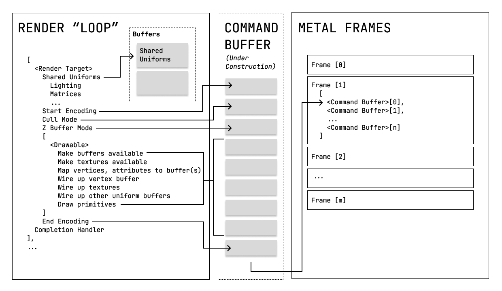

# MapLibre Metal Port Design Proposal

Before we dive in, a bit about our process.  Stamen Design, with a sub-contract to Wet Dog Weather, has been contracted by Amazon (AWS) to develop two proposals to upgrade MapLibre Native.  The first was the Rendering Modularization Proposal.  This one is the Metal Port.

The mechanism for this will be a Pull Request, which we have obviously opened.  This will result in as much discussion as the community would like here, on the OSM Slack and by email or video call (we're available, so reach out).  As we wrap up our specific proposal, that discussion will hopefully reach a consensus and we'll be ready for a Yes or No on the PR by the end of the year.

This proposal is to implement a rendering module as defined in the earlier Rendering Modularization proposal.  Some of those stages are reflected here directly, such as "Snapshotting".  Others are spread across multiple passes in this documents.  For example, the Shader Registry from the Modularization proposal is directly referenced but will be used in each of the Shader related passes.

## Motivation

MapLibre Native is currently depending on a deprecated rendering SDK (OpenGL) for iOS. It needs to move to Metal for iOS in some form.  Thus the graphics implementations must diverge, either by doing so within MapLibre Native or depending on another toolkit to do the rendering entirely.

We are proposing the former approach, with support for multiple rendering SDKs in the MapLibre Native toolkit itself. That is discussed in more detail in the MapLibre Rendering Modularization Design Plan.  This proposal assumes that one is adopted.

But before that, a quick note on terminology.
- "toolkit" usually refers to MapLibre Native, but may also be used in context for another project at a similar level.
- "SDK" or Software Development Kit usually refers to the rendering library, like OpenGL or Metal, at least in this document.
- "API" refers to an Application Programming Interface.  In this context it refers to the classes and methods made available to a developer.

## Goals

It is useful to split our goals into three sections to articulate what this proposal aims to accomplish:

- **North Stars:** These guide the overall direction of the proposal, and are the overarching _why_.

- **Core Functionality:** These are concrete changes we are proposing to the library to get to our North Stars.

- **Evaluation metrics:** These are specific criteria we will accomplish through this proposal.

### <a name="north-stars">North Stars</a>
1. The MapLibre Native toolkit should use Metal for rendering on iOS & MacOS
2. The Metal implementation should follow the pattern laid out the Rendering Modularization PR.

### <a name="core">Core Functionality</a>

1. The OpenGL renderer will still be available on iOS as a compile time flag
2. Shaders will be reimplemented in Metal
3. Off screen targets will be implemented in Metal and exposed in a such a way they can be read from and shared
4. Rendering passes will be implemented in Metal
5. Screen snapshots will not block the rendering pipeline
6. Atlases will be implemented for Metal and be accessible from any thread
7. The Metal renderer will be optimized to the best of our abilities
8. The toolkit will allow mixing of real time assets from other Metal based toolkits

###  <a name="eval">Evaluation Metrics</a>
1. The new version of MapLibre with Metal should support all iOS devices that support Metal
2. .... should not be any slower than the OpenGL version
3. .... should be significantly faster in most test cases
4. .... should use the main thread less than the previous version on iOS
5. .... should look as similar to the old rendering as possible

## Proposed Changes

Before we dive into the specific changes we wish to make, let's discuss how software development works with one of these low level rendering SDKs.

Anyone who has worked with OpenGL knows that first you get nothing.  Traditionally, it's a black screen and a lot of tweaking before the developer sees anything.  And then a lot more tweaking before the developer sees anything useful.

With Metal, you get crashes with error messages usually related to what you actually did.  This is a huge improvement!  And the debugging tools... well they do exist and they mostly work.  They work better in direct mode and with smaller test cases, so we plan accordingly.  When they do work, you can actually debug a shader!  That's very helpful.

With modern toolkits, Metal included, you start out with what the GPU is expecting and work from there.  This can be conceptually easier, but it's still real time rendering and you can still do a variety of frustrating things that are a difficult to debug (like crash the hardware).  Developers will run into weird cases that are hard to debug and you need to plan to lose a few days here and there.

What that means for planning is a lot of little stages and a gradual hike up the difficulty curve.  We start with the simpler stuff and work our way to the more complex and we emphasize getting something to look at sooner.

That sounds a bit scary!  But don't despair.  Once the developers get the guardrails in place and have it basically working, new problems tend to be fairly rational.  You don't get the deeply strange crashes unless you're doing something weird.

We're also going to deviate a bit from the format of the Renderer Modularization Design proposal.  In that case we broke each section into *Required Changes* and *Benefits*.  The first set of these changes are all the same:  You have to do it to implement Metal.  The benefit is it works in Metal.  There's no practical mixing and matching with OpenGL.  If you want Metal support, someone has to do the first 10 of these tasks.

### First, Do Nothing in Metal

_Addresses North Stars [#1](#north-stars), [#2](#north-stars) and Core Functionality [#1](#core)._

At the end of the Renderer Modularization work we'll have an OpenGL ES module for rendering to that SDK.  That will consist of a group of files, probably in a sub-directory, that can be included in the toolkit with a compile flag.

We'll want to do something similar for Metal.  We suggest building out the full set of files for that module in the most minimal way possible.  That is, a rendering loop that sets up, tears down, and renders nothing to the screen.  For textures, render targets, drawables and builders, again just stubs that do the minimum required to keep the toolkit from crashing.

### Rendering Loop, Simple Metal Drawable, Simple Shader

_Addresses North Stars [#1](#north-stars) and [#2](#north-stars)._
_Addresses Core Functionality [#2](#north-stars)._

Once the renderer_impl module exists for Metal, it's time to start fleshing it out.  This is where the rendering "loop" begins, though subsequent development will change it.

The easiest place to start with the Metal renderer is in the overlay layers.  We'll start with a single overlay layer that draws a rectangle over part of the screen.  This will consist of a custom Metal shader paired with simple vertex data.

Getting the skeleton version of the Metal Renderer in place is the purpose of this work.  When it's going, the developers should see a single rectangle overlaid on the clear color.  Not terribly exciting, but an easy start and a good place to branch off work with multiple developers.

### Textures

_Addresses North Stars [#1](#north-stars) and [#2](#north-stars)._

The MapLibre Native toolkit already knows what a texture is, so this is the Metal Texture variant.  Metal textures don't deviate all that much from the OpenGL in concept, but the specifics very much do.

Metal supports a whole host of texture formats that Maplibre Native doesn't (or does through extensions).  There is the traditional RGBA, but there are also 32 bit float, or dual 16 bit float, or.... the list goes on and on.  We want to allow support for these without losing our minds representing them.

As it stands, supporting RGBA is probably sufficient, but the utility of a good single component 16 bit texture is not to be denied and neither is the flexibility of a 32 bit floating point texture.

We should at least fill out a handful of those image types.  Which ones aren't all that important, but the workflow for adding new ones is.  It should be simple to add the logic for a new type, but we don't need to go so far as seamlessly converting from one to another.

Render Targets make use of that image type enum as well, but we'll address that later.

We also want a way of representing a texture that isn't ours.  That is, a texture that comes from another Metal toolkit that we may be using as input (or output).  iOS and MacOS have some incredibly powerful image processing utilities that run in real time if you know how to use them.

### Off Screen Render Targets

_Addresses North Stars [#1](#north-stars), [#2](#north-stars) and Core Functionality [#3](#core)._

Off screen render targets are used in a couple of ways.  The most obvious is when rendering an image of a map offline.  The developer sets up the toolkit, feeds in a map and captures the result from a particular viewpoint.

Less obvious is for things like heatmaps or weather data.  In those cases we want to render a tile source to a particular target, bound to a texture, and then reuse that texture later in the rendering process.  We do this kind of thing a lot with weather data in WhirlyGlobe-Maply.  MapLibre Native does something very similar with heatmaps.  It's a very powerful technique.

The actual information around a render target is actually not that complex.  They just need to know what their format is (32 bit float?  RGBA?), how big they are, an optional stencil component and what's supposed to be drawn to them.  The rest is just an outer loop in the renderer.

For the Metal implementation we'll just need a texture to render to.  There is also an advanced case where the texture only exists on the GPU and can only be read by the GPU.  This can speed things up considerably and can be represented with a simple setting.

### Renderer Observer, Rendering Passes

_Addresses North Stars [#1](#north-stars), [#2](#north-stars), and Core Functionality [#3](#core), [#4](#core), [#8](#core)._

When the developers have a basic render loop going with drawables that do nothing, the next step is to build out the observability and make the structure of the rendering itself more flexible.

After the Modularization PR is finished we'll have a representation for individual rendering passes.  This is similar to what the Heatmap makes use of internally, but it'll be more explicit.

The rendering loop itself is affected by these passes.  We want the output of one to feed into the input of another and we want to make sure they're rendered in the right order.

As for the renderer observer, we'd like to expose each level of that as appropriate.  As to why, exposing things like the command buffers at the right time allow integration of Metal compatible functionality from other toolkits.

### Full Drawables and Builders

_Addresses North Stars [#1](#north-stars) and [#2](#north-stars)._

Once all the basics are set up, it's time to get back to the specifics and Metal drawables are very specific.

With the Modularization PR finished, we'll have a generic Builder interface that the Layers use to emit Drawables.  Each Builder variant will have a Metal Builder variant and it's those we'll need to build here.

My suggestion for this development phase is to start with a fairly core function, like Fill, and implement the Metal version of that.  Use it to flesh out the Metal Drawable.  Practically speaking, that means allocating and filling out Buffers.

Then I'd suggest moving to a more specific Builder, like the one for lines.  That will turn up problems with the Metal Drawable, most likely, and afford an opportunity make it more general.  Once that's working, on to the next Builder and so on.

### Shaders (Basic)

_Addresses North Stars [#1](#north-stars) and [#2](#north-stars) and Core Functionality [#2](#core)._

Implementing the Metal version of the basic shaders should be intermingled with the last section.  Get a new type of Builder working, wire it up to a new type of shader.  Then go back and pick another type.

For each shader, we suggest doing a straight conversion from the OpenGL.  Take the GLSL source and convert it manually, ideally with comments describing the choices you made.  There will be a chance to revisit the shaders in a later phase, so don't worry about efficiency quite yet.

At the end of that process, all the Builders should be fleshed out and all the Shaders should be working.

### Atlases

_Addresses North Stars [#1](#north-stars), [#2](#north-stars) and Core Functionality [#6](#core)._

MapLibre Native makes use of atlases for 2D and 1D(ish) textures.  The distinction exists largely because of OpenGL texture wrapping logic.  When you go off the edge of a 2D texture in X or Y you can either clamp to the edge or wrap around.  In OpenGL that distinction is tied to the texture itself.  In Metal, it's the shader that decides.  That's much easier.

As such, the atlases could be merged into one type.  We'd leave up to the developers if they want to merge those into one.  There are arguments either way, but it wouldn't be time consuming.

In either case there will need to be Atlas specific logic for Metal.  Most of that is memory blitting, which can be done on any thread.  We do need to make sure that a given Atlas entry lives until the end of the last frame that uses it.  Passing messages around to that effect is simple enough.

### Data Drive Styling

_Addresses North Stars [#1](#north-stars) and [#2](#north-stars)._

Style Sheets support the concept of data driven styling.  That is, colors or widths or a variety of other attributes controlled by either global variables, like zoom level, or the values of attributes within a given vector tile, or.... other things.

Some of this is implemented in the low level renderer in OpenGL.  We can copy that design over initially to get something working.  Longer term, we'll want to move more of this work into the shaders.  In any case we'll be updating little bits and pieces of the Drawables, which is useful functionality to have available.

As a first pass, we'll get the output of that logic in the existing renderer to update the bits and pieces as needed.  Then we'll propagate those changes to the Drawables themselves and pick them up in the direct encoding pass.  Things will change with Indirect rendering later on.

### Snapshots

_Addresses North Stars [#1](#north-stars), [#2](#north-stars) and Core Functionality [#5](#core)._

In Metal you may have several different frames in flight at once.  Ideally you don't want to slow them down to make a copy of the latest one for a screen shot.  You need to know when a frame is finished, but not block while you copy it.  Luckily, there are a couple of things to make this easier in Metal.

First up, there are a separate set of memory blitting commands to encode as a part of a command buffer.  This lets you make an explicit copy of the the frame, even downsampling it if needed, to a separate memory buffer.

Second, there's a completion handler that Metal will call when a frame is... completed.  This is when a developer can take control of that memory buffer and do something with it, ideally on another thread.

Do this fast enough and you may be able to take a series of snapshots or even encode video.  But at the very least, you're not holding up the renderer.

After this phase is finished, you'll have a working Metal renderer for MapLibre Native.  Congratulations!  The rest is optimization, but you don't want to skip it.  This is where you get to compete with the big dogs.

### Heap Support

_Addresses Core Functionality [#7](#core)._

If you thought real time rendering was mostly about triangles, I have some bad news.  It's more about memory management.  There are two ways for handling memory in Metal (that we'll deal with), the boring way and the good way.

The boring way is to allocate Buffers and stick your geometry, indices, textures, uniforms, car keys, manifesto, and texture coordinates in them.  They're just memory.  You ask for how much you want, you get a handle, you copy what you need into place.  You fix whatever buffer overruns you created.

Metal isn't fussy about a buffer containing vertices vs. indices vs. uniforms.  Mostly.  So you build a little buffer management infrastructure and alway use it.

The nice thing about Buffer allocation in Metal is it can be easily done from any thread.  The bad thing is all those little bits of memory are time consuming to track and control, just like in any system.  Thus there is a better way.

The good way to do memory management is heaps.  Instead of allocating a buffer in random shared memory, you allocate it out of a Metal Heap.  Metal's attitude toward what's in that Heap is "you do you".  A lot of the guardrails go away and you're very much on your own for managing that memory.  But it is so very, very fast.

The reason Metal Heaps are fast goes back to the Metal Renderer figure.  All of those lines related to wiring up buffers get much simpler.  Every time you tell Metal about a bit of memory needed to feed the Shader it has to figure out where that memory is, make sure you're allowed to access it, do the math for the offsets and make sure you're not outside the bounds.  You might pass in a lot of buffers to a particular shader and there are going to be thousands of the things for a given scene.

If we allocate Buffers out of Heaps, then we just need to pass in the Heap and what amounts to an offset.  Metal does much less work for each shader and is less power hungry for the same frame rate.

The drawback is Metal is no longer doing all that checking for us.  So you want a non-Heap version to fall back on when chasing down memory bugs.

#### Required Changes

The developers will probably implement some Buffer allocation infrastructure in a previous phase for Textures and Drawable Buffers.  That will need to be extended to handle Heaps.

We found the following to be useful in WhirlyGlobe-Maply:
- Allocate a Buffer of a certain size with or without an NSData object to be copied in
- Allocate a Texture Buffer of a certain size with or without an NSData object to be copied in
- Return a handle to describe what was allocated.  If there's additional information, like a Heap, this is where to stash that.
- If a given object is too large for the pre-allocated Heaps, just create it on its own
- For a Drawable, reference the Heap and pass in the buffer offset as needed

In the end, heaps are heaps and these are fairly standard

#### Benefits

Managing Metal memory with Heaps is more efficient than individual buffers.  Buffer management tends to dominate the low level wiring of Drawables.  For each frame, much of what you're doing on the CPU is pointing a drawing command at its buffers.  With Heaps, you still do that, but much of the checking goes away.  You make the appropriate Heaps available and then the driver is largely just dealing with offsets.

It's fast and it's a key step to getting as much work as possible off the main CPU.

### Indirect Encoding Implementation

_Addresses Core Functionality [#7](#core)._

The implementation up to this point is Direct.  For each frame we fill out the same command buffers.  Sure, the data buffers are reused, but the command buffers are created, filled in, and handed over to Metal each and every frame.  This is not dissimilar to OpenGL, in a way, but still more efficient.

Any time you're doing the same job over and over again, the question is:  Can you not?  It turns out you can... not... do the work.

The trick with indirect rendering in Metal is to separate the parts that change a lot from the parts that don't change very often, or ever.  Uniforms for map position, lighting, etc may change every frame.  So you update them every frame.  But the geometry for a tile isn't going to.  Most of the uniforms for a set of roads won't either, except some might with data driven styling.

There are a couple of ways to handle this.  One is to maintain a list of redundant buffers for anything that may change, one for each frame in flight.  So, for example, you may have 5 buffers for the core uniforms (matrices, lighting, etc) and you iterate over them for 5 concurrent frames.

The approach we used in WhirlyGlobe-Maply was a bit more complex, but used less memory.  We set up each changeable uniform buffer for a given frame and then copied it into place using a Blit Encoder.  That's basically a construct used to copy memory around on the GPU.

For Drawables, we looked for updates to any of their key values (texture IDs, colors, etc) and blitted those into place as needed.

A similar approach will work for MapLibre, but with the extra complication of data driven display.  Some of those parameters can probably be handled purely in the shaders.  Some will need to update buffers.

#### Required Changes

Direct vs Indirect rendering only touches a couple of points in the toolkit.  First, is the rendering "loop" which will need to be broken into two parts:
- Construction of the indirect command encoders.  This is the whole point and it can be done once for a group of geometry that won't change much.
- Referencing the indirect command buffers.  The point here is these can be referenced as a group fairly quickly.

If it hasn't already been dealt with, this is the point at which having multiple frames in flight becomes a real problem.  You can get away with avoiding the issue in Direct rendering by just re-encoding everything and not sharing buffers that need to be updated per frame.

For Indirect rendering you need to update those shared buffers (e.g. lighting, uniforms) and anything that's specific to a Drawable but changes and you need to update that on a schedule.  Specifically, you have to do it after it's used by the previous frame, but before it's used by the current one.

In WhirlyGlobe-Maply we did this with a fence, to make sure frames weren't falling over each other and a blitting step that copied data references into place at the right time.  It was plenty fast.

Developers might want to explore the other option here, which is a rotating list of buffers that match to the number of in-flight frames.

#### Benefits

You can probably get away with only Direct rendering support.  You might say "oh, we'll do indirect later", but you won't.  It requires some fairly complex changes to shaders and the internal buffer management architecture.  It's not something easily done by an individual and when the team you assemble to do the first part of this project wanders off you'll have trouble assembling a new one just for this.

Why do you want to do this?  Well, there's performance of course.  If MapLibre Native isn't used by millions of people now, it will be.  That's a lot of energy consumption and a lot of responsibility.  You owe it to those users to carefully allocate the resources given to you.  Burning down the battery faster than MapKit and Google Maps is a bad look.

There's also prestige.  When a developer is comparing toolkits yours should be, if not the best, at least in the running.  That's the toolkit they want to use and the one they want to contribute to.  Plus hey, it's free.

Does that prestige matter?  Well, I (Steve G) have used MapLibre Native's OpenGL implementation against it when comparing to our own toolkit (WhirlyGlobe-Maply).  If you do a mediocre Metal implementation, your competitors will definitely bring that up.  I certainly would.

### Atlas multi-thread support

_Addresses Core Functionality [#6](#core)._

The various atlases are designed around OpenGL constraints, and single threaded constraints at that.  Metal is much more flexible in how these kinds of data structures can be accessed.  So flexible, in fact, that we can probably leave them as designed or seamlessly upgrade them without changing much in the way of interfaces.

It's not obvious at this point how extensive an Altas rework should be.  At the very least, any Atlas related logic should be moved out of the main rendering "loop".  Beyond that the Metal Atlases could be made thread-safe fairly easily.  The OpenGL Atlases could be as well, but that's outside our scope here.

When using a texture atlas, you can either rescale texture coordinates before they get to the renderer or you can represent the entry into a texture atlas explicitly.  We do the former in WhirlyGlobe-Maply, but have always suspected the other might be a better idea.  Certain operations in shaders become much easier when you know what sort of texture you're pointing to.

To that end, we may want to add the notion of an entry in a texture atlas rather than a simple texture.  This structure would make its way all the way down to the shader and be decoded by the vertex shader itself, though you could make a case for the pixel shader decoding it at times too.

We may also want to consolidate all the texture atlases into a smaller number of types.  That will become clearer after the Modularization rework.

#### Required Changes

We've only dug into the Atlas implementation a bit.  Frankly the way they interact with glyphs and line styles and such is a bit confusing and atlases aren't all that complex a concept to begin with.

As to what changes will need to be made, my sense is they'll be focused on:
- Making it easier to use atlases from the Layers
- Dealing with life cycle issues.  In other words, don't delete the texture while it's still being used.
- Possible consolidation of two or more of the types.  Metal treats texture parameters differently so less needs to be broken out.

Once the developers get to this point it should be obvious if this pass is worth doing and what should be in it.  There's also the question of what we may want to do with freeform text.

#### Benefits

Texture atlases do sit at the heart of many of the vector tile related features.  As they exist they'll probably work okay.  What's less clear is how they interact with a true multi-threaded model.  The point of this pass is to clean up any problems related to atlases, Metal, and multi-thread performance.

### Layer multi-thread support

_Addresses Core Functionality [#7](#core)._

There's no good reason Layers shouldn't be able to do all their work on separate threads.  On iOS, ideally separate dispatch queues.  This is possible up to a point right now, but the toolkit does not take advantage of shared OpenGL Contexts and those single threaded assumptions are built in.

The Modularization rework should free this up a bit, but it's here that we'll want to actually try it out for Metal.  We'll see how far it can be pushed during this phase.  There may be bottlenecks in the non-rendering portion of the toolkit that assumed similar bottlenecks in the rendering that no longer exist.

The goal here is to move as many setup stages as possible off the main thread.  That should include all the buffer allocation and setup and some of the indirect command buffer encoding.  Direct encoding is going to still occur on the main thread.

#### Required Changes

It's not clear what changes will need to be made here.  The process goes like this:
- Find a good test case.  Usually something that involves a lot of zooming and panning.
- Run the test case while recording one or more of: memory or CPU
- Look for a bottleneck
- Fix the bottleneck

Typically bottlenecks are where the main CPU is waiting on something it shouldn't be, or tiles are only being loaded on a single thread or other similar issues.  It's never obvious until you start staring at the traces.

#### Benefits

MapLibre Native makes some use of threads, but not as much as it should.  With OpenGL it's not using shared contexts, though it does a lot of work in the Layers to prep for the GL work that has to be done on the main thread.  So it's not terrible, but it obviously could be better.

Mobile devices, even the really cheap ones, now have a lot of CPU cores and a lot of opportunity for work to be done off the main thread.  Maps have an embarassing amount of high level parallelism.  It's worth periodically analyzing the performance to see what might be updated for data loading.

The benefits are faster loading, lower latency, better responsiveness to the user.

### Shader optimization

_Addresses Core Functionality [#7](#core)._

The first version of shaders will work with the direct rendering in Metal.  They'll be simple manual translations from the GLSL in the existing toolkit and they'll look and act similarly to the old shaders.

The second version of the shaders will consist of changes to support indirect rendering.  The way buffers are passed in is different when doing indirect rendering in a way that's not obvious.

Further, this is the time to break the shaders to modular pieces to be reused by developers outside the toolkit.  Passing in a new shader to replace existing functionality works a lot better when you can call sub-routines to implement that MapLibre Native basics for you.

#### Required Changes

This pass is the last version of the shaders and would consist of:
- Modularization.  We can make it easier to reuse shaders by sharing code where useful.  Even putting the core of a given shader into a subroutine would make it easier to reuse.
- Data driven styling.  How much of that logic can be pushed into the shaders?  The more work they do, the less the CPU does.
- Optimization.  Apple provides tools for analyzing time spent in the shaders.  Some optimization here is always useful.
- Packaging.  Normally Metal shaders are pre-compiled and shipped with the app binary.  We may want to support a pure source version.

We'd also suggest writing a couple of examples here for implementing your own shaders.

#### Benefits

Optimization tends to get lost in these projects, but it yields dividends later on.  Less time spent on the CPU, in particular, makes room for more functionality.

Adding your own shaders is one of the big goals.  If we can break up the common functionality in nice sub-routines that becomes much easier.  Ideally we can foster a community of incremental updates to add new features, rather than having to periodically do these big updates.

### Bug Roundup

Bugs in rendering SDKs can be very subtle.  The interaction between hardware, drivers, and software is complex and the patterns may not become clear until a certain number of devices are reached.  When tracking down obscure rendering bugs in WhirlyGlobe-Maply we will often have problems that can't be reproduced and have to guess at the cause from nearby crashes.  It's not as bad as it sounds.

To address this, we suggest allocating a bug squishing pass a head of time.  This should be several months after the initial development is complete and at least one big deployment has occurred.  With WhirlyGlobe-Maply our clients ended up absorbing this pass, but it would be wiser to plan ahead.

#### Required Changes

This depends entirely on the bugs we find.

#### Benefits

Big development projects do generate bugs.  We can certainly depend on a good number of testers.  The community is active and involved.  This will help immensely.  But we do want the big companies to adopt this new version and we want to fix what they find.  As such, scheduling a post-development bug sprint with the team that does the work would be a good idea.

## API Modifications

At present we do not expect to change any existing APIs at the public level.  We do expect to add some new API methods and classes.  We would detail these as we proceeded with the implementation.

## Migration Plan and Compatibility

We do not intend for these changes to be incompatible with the existing version.

## Rejected Alternatives

The main alternative would be switching to an intermediate toolkit to implement both OpenGL and Metal.  The problem with that approach is toolkit size.  Quite a few users cannot abide with the toolkit growing considerably.

We considered trans-piling the shaders from GLSL.  The advantage would be in skipping a shader writer step.  The disadvantage is that the existing shaders are designed off a fairly old model of how GPUs work.  They're very optimized for that approach and somewhat inscrutable as a result.  In Metal we'd like to start over with the functionality required of the shaders and build something more modular for future use.

## Pull Request Schedule

At the request of the community we've put together a list of Pull Requests that we would organize the work into.  These would be individual pieces that would leave the toolkit in working shape (except for the first one) and set us up for the next PR.

#### PR 1: Doing Nothing, but with Metal

You have to start somewhere and this is where the developers start.  A blank renderer that does nothing, but does it with Metal.

Sections covered:
* First, Do Nothing in Metal

By the end we should have:
* A blank screen that draws nothing at 60 frames per second in Metal

Tests:
* Does it crash?

#### PR 2: Functional Metal Support

Put simply, time to get Metal working. This is the direct Metal implementation with all the attendant support.

It's not really practical to break this down much further.  Where there may be individual PRs on a Metal branch, there won't be anything usable until this PR is complete.

That is not to say multiple people couldn't work on it.  It'll just need to live in its own branch until complete.

Sections covered:
* Rendering Loop, Simple Metal Drawable, Simple Shader
* Textures
* Off Screen Render Targets
* Renderer Observer, Rendering Passes
* Full Drawables and Builders
* Drawables and Builders
* Shaders (Basic)
* Atlases
* Data Drive Styling
* Snapshots

By the end we should have:
* A MapLibre Native toolkit that renders fully in Metal

Tests:
* All the visual rendering tests

#### PR 3: Advanced Metal Support

The basic Metal implementation is good, but it leaves a huge amount of performance on the table.  Direct encoding in Metal is more efficient than OpenGL, but it's still not that efficient.  To get the good stuff you need indirect rendering, where even more of the prep is done ahead of time.

This might seem like overkill, but remember that maps eat a ridiculous amount of power on modern phones.  The more efficient the map, the less power it consumes for the same frame rate.

Sections covered:
* Heap Support
* Indirect Implementation

By the end we should have:
* A map that uses significantly less CPU in general
* A map that uses significantly less of the main thread
* A map that can run at higher frame rates

Tests:
* All the visual rendering tests
* Memory usage before and after this change
* CPU usage before and after this change
* Frame rate for an example map before and after this change

#### PR 4: Multi-threaded testing & Fixing

The toolkit makes some use of threading at the moment, but not nearly to the extent it should.  Threading is possible with OpenGL shared contexts and it's downright easy with Metal.  The purpose of this PR is to take the new Metal support out for a spin and look for bottlenecks.

Sections covered:
* Layer multi-thread support

Tests:
* All the visual rendering tests
* Measure loading latency before and after this work

#### PR 5: Shader Optimization

One of the goals of this work is to make developing shaders a bit more tractable.  To that end, we'll want to reorganize the source code and break out shared routines.  We'll also want to make sure we don't introduce new problems when modularizing the old code.

Sections covered:
* Shader optimization

Tests:
* All the visual rendering tests
* Measure shader performance on multiple classes of hardware before and after this work

#### PR 6: Bug Roundup

It's easy to introduce subtle bugs when implementing a renderer.  This phase should be scheduled several months after the previous deliveries.  We expect to find bugs and we expect individual groups to fix or work around them.  This is an opportunity to look at those bugs for any underlying problems.

Sections covered:
* Bug Roundup

Tests:
* All the visual rendering tests
* Specific tests related to any bugs that turned up
