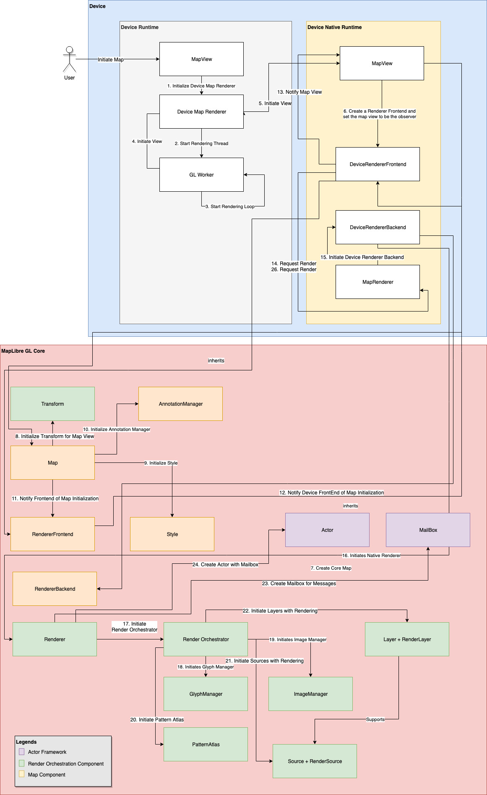
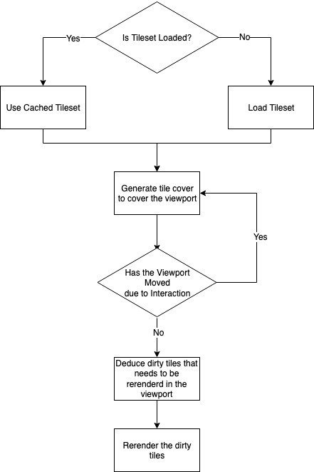
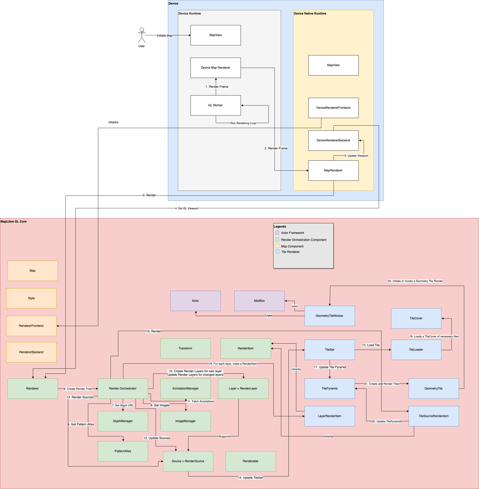

# Android Map Rendering Data Flow

*Figure 5: Simplified data flow diagram of initializing a map in Android*

Figure 5 shows a simplified data flow diagram of initializing a map. The
device section of this data flow diagram is based on Android platform.

Before the map initialization request makes it to MapLibre Native
Core, the request initializes a set of peer components in the platform
or device runtime. Especially for Android, we have parts written in C++
using *Android Native Development Kit* and parts written in Java.

A map initialization starts with initializing a map in an Android View.
A View occupies a rectangular area on the screen and is responsible for
drawing and event handling. In this diagram this is denoted as a Map
View inside the device runtime. This view is also responsible for
initiating a Device Map Renderer which subsequently initializes a GL
Thread worker. This thread is a render loop that takes UI events from
the Android View and passes it downstream to get the rendered map.

On the native C++ side of the device code, we see a peer Map View
component. This one is a wrapper class between the Android Map View and
the generic Map Component. For Android, this maintains the JNI method
contract established from the Java runtime. The render thread this
document talked about before is seen in the form of *MapRenderer*. This
is an Actor that passes the rendering events from the device runtime to
*MapLibre Native* renderer.

*Figure 6: Workflow of rendering tiles*

Before the frame-by-frame map rendering
starts with *MapLibre Native* renderer, the generic map component
gets initialized. Rendering each frame of a map tile or initializing the
map view requires a set of *Transforms.* Through transform basic
mutations like rotation, tilt, projection is accomplished. Transforms
are essential for every aspect of rendering such as resizing the
viewport, setting initial map camera, changes in map camera due to tilt,
zoom, and movement. Each of these operations manifest into a set of
*Transforms* that gets applied to the to-be-rendered map tile or already
rendered map tile. The *Transform* class noted in the diagram however
does not represent a single or multitude of transformations. A Map View
like other components inside MapLibre works as a state machine. The
*Transform* class maintains the current set of global transforms applied
to the map. To simplify to change the camera orientation, zoom, or pitch
a Map View will update the state of the Transform class. And the
Transform class will use observers to send a transform event to
*MapLibre Native* renderer. This overall transform directive, such as
change camera location from point A to point B will translate to a set
of transformations deduced by the *Renderer* component.

Along initializing the *Transform* state, the Map View will also
initialize the *Style* sub-component. The Style component here also
follows a state machine-esque behaviour. It holds the current state of
used Styles for the Map View along with layers, glyphs, and sources. A
change in style or initialization of style translates to re-loading the
*Glyph Atlas*, *Sources, and Layers.* A *Glyph Atlas* is a combined
image all glyphs. The renderer slices the necessary glyph by bounding
boxes whenever necessary. Different sources are loaded differently. For
Tilesets, the tile data is loaded but not rendered right away. For
client provided data sources such as GeoJSON, the data is loaded from
the file source or code. Then these sources are organized into layers
dictated by the style and the layers are sent for rendering through the
actors.

The key philosophy of rendering tiles is tiles are rendered layer by
layer. A collection of tiles is called a tile set. To optimize tile
rendering, MapLibre Native only renders *dirty* tiles. A dirty tile
is a tile rendered in the viewport that has changed due to user
interaction. To initiate this process, MapLibre Native loads the
tileset to be rendered first. In a rendering request, if the tileset is
already loaded, MapLibre Native will use a cached tile set.

The next decision to make here is which tiles are to be rendered on the
viewport. To deduce this, MapLibre Native translates the device
viewport coordinates[^20] to a tile cover. A tile cover loads all the
tiles that will rendered to current viewport. If the viewport already
has all the tiles that is needed to be rendered by the deduced tile
cover, there are no *dirty* tiles. If the tile cover somehow has a
single or all new tiles to be rendered in the viewport, the existing
tiles displayed in the viewport are deduced to be *dirty.* And only
these tiles are replaced instead of a complete re-render.

Moving to the render flow now. The render flow is depicted in Figure 7.
The diagram introduces a new component block named a *Tile Renderer.*
These diagrams might look verbose but in reality, they are a simplified
version of the actual code flow.

The render workflow stays the same as the initialization workflow up to
*reaching the Render Orchestrator.* This time instead of initializing
the *render orchestrator*, the flow uses the render orchestrator to
create a *Render Tree.* A render tree is a tree of to-be-rendered items
in order. This includes rendering items from layers, sources, line
atlas, and pattern atlas. A render orchestrator does not render anything
by itself. It orchestrates render items for the *renderer*.

In the render loop ran by the *Renderer*, each render request ends in
*creating a new render tree, and the render function.* The render
function uses a glyph manager for fetching glyphs and font stacks that
contains said glyphs. Sources and Layers are translated to
*RenderSource* and *RenderLayer* objects.

*For the sake of restating, a layer is composed of a set of sources.*

*Figure 7: Simplified data flow diagram of rendering map tiles*

A *RenderSource* is produced from a single
source that has an internal *update* method. This method produces the
*tile pyramid* to render for said source if the source is a
*TileSource*. For brevity, this document only talks about tile sources.
There are other types such as GeoJSON sources. They work in a similar
manner as the tile source.

_________________________________

[^20]: Viewport coordinates are derived from the coordinate system of
    the device screen. Anything rendered inside a unit cube of local
    space is translated to screen space of actual pixels. The tiles are
    rendered in a local space before rendered back to screen. We will
    see more about that in Coordinate System section.
