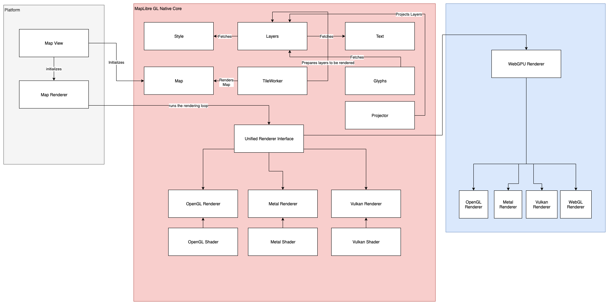

# Architectural Problems & Recommendations

Up until now, this document focused solely on the state of MapLibre
Native at the time of writing. This section speaks of possible future
improvements for MapLibre Native from an architectural point of view.
Before that, let's look into the architectural challenges MapLibre
Native is facing[^18]:

## Renderer coupled with OpenGL

The renderer component is tightly coupled to OpenGL ES. It uses OpenGL
ES as its only preferred rendering backend. Furthermore, MapLibre
Native does not have a clear separation between the following:

1.  The logical responsibility of rendering a map tile. This involves
    sourcing layers, applying styles, fetching glyphs and sprites for a
    map tile.

2.  Rendering a prepared map tile in a rendering loop for a graphics API
    such as OpenGL.

The current rendering loop is only implemented for OpenGL. In 2018,
Apple deprecated OpenGL for both iOS 12 and macOS in favour of Metal.
Metal is Apple's own 3D graphics API. MapLibre Native's sole
dependency on OpenGL ES puts it in a risk of deprecation for iOS
customers.

## Lack of support for other map projections except Web Mercator

MapLibre Native supports Web Mercator (EPSG:3857) as its only
supported projection. This fulfills most of the web and device map
needs. At the time of writing, modern map renderers such as Google Maps
and Mapbox GL offers 3D globe, conic, and rectangular projections too.
At the time of writing, MapLibre Native renderer component does not
have an architectural separation for supporting multiple projections and
coordinate reference systems.

## Inconsistency among platforms

Each MapLibre Native platform has a Map View and Map Renderer
component. The inconsistency introduced due to differences in
concurrency model and programming language is unavoidable. But from an
abstractions point of view there are inconsistencies that can be
mitigated:

1.  Map Configuration is modeled inside MapLibre Native Core, the
    shared cross platform codebase. Each platform creates its own
    configuration class and creates a shadow native object. The native
    configuration object is consistent across platforms but the platform
    specific configuration is not.

2.  MapLibre Native has a sister repository named MapLibre GL JS. At
    the time of writing, MapLibre GL JS does not share any code with
    MapLibre Native except shaders, the style specification, and
    render test fixtures. This creates a feature inconsistency across
    web and device experience for customers. The rendering architecture
    is also different between Web and Mobile. MapLibre GL JS currently
    uses WebGL through completely different implementations for Map,
    Style, Layers, Glyph, and TileWorker.

3.  MapLibre Rust is an experimental initiative to create a new MapLibre
    implementation in Rust, entirely based on *WebGPU*. At the time of
    writing, *WebGPU* is a young platform that exposes modern computer
    graphics capabilities, especially Direct3D 12, Metal, and Vulkan
    through a shared API. It has promise, but the API at the time of
    writing only supports ChromeOS, macOS, and Windows 10. Technically,
    it can be used with Android and iOS but these platforms do not
    provide out of the box support for it. This also has created a
    divergent experience for customers when it comes to using MapLibre
    Native.

## Lack of documentation

Last but not the least, MapLibre Native suffers from a general lack
of documentation. This includes current state of the code architecture,
continuous integration and development, testing strategy, and a roadmap
for future improvement. This document intends to address the first.

## Recommendations

This document proposes the following component architecture for MapLibre
Native to address the architectural shortcomings.

*Figure 4: Proposed Architecture of MapLibre Native*

Proposed architecture of MapLibre Native in Figure 4 addresses the
aforementioned problems by:

#### Modular Rendering

Introducing modularized rendering through *Unified Rendering Interface*.
Unified Rendering Interface component will be responsible for
implementing different graphics API workers for any tile workers. Each
of these rendering workers will use platform specific shaders. This
document does not dive deep into how these shaders will be produced or
orchestrated. The problem *Unified Rendering Interface* solves is
architecturally drawing a boundary between

1.  The responsibility of rendering a map tile through GPU and,

2.  Gathering all layers necessary to render a map tile through *tile
    workers*.

#### Projector Component

Introducing a new component named *Projector.* A *projector* component
is responsible for adding multiple projection and coordinate system
support for map tiles. Projector will take the *features* to be rendered
as an input and project the layer to a projection or coordinate
reference system. Projected world coordinates will then be translated to
native device coordinates.

One example of introducing new component is supporting 3D maps in the
future. This could mean rendering map tiles on a spherical globe instead
of a flat 3D plane. At the time of writing MapLibre Native supports
2.5D extrusion for buildings and terrain tiles. Supporting confidential
datums like *GCJ-02* can also be achieved through this.

#### Future Convergence with WebGPU

This document acknowledges the value proposition Rust brings. At the
time of writing, MapLibre Native Core is written in C++. Albeit written
in C++, MapLibre Native code relies on immutable message passing between
renderer and tile workers. Private functions also follow the *C++ move
semantics*. This means, each private function takes ownership of the
arguments passed to the function by copying it to a new memory.

Rust as a programming language enforces such intentions through compile
time safety checks. Provided Rust Foreign Function[^19] Interface allows
interoperability with Rust, this document proposes the following to be
done in sequence:

1.  At first, this document proposes to implement ***Modularized
    Rendering*** in C++ for MapLibre Native. This document also
    proposes that Unified Rendering Interface will keep the door open
    for a *WebGPU* backed renderer in MapLibre Native. This could address
    the divergence of web and native platforms in the future. The WebGPU
    renderer might be possible to compiled to WebAssembly and enable
    WebGPU powered rendering for browsers. This paves the path forward for
    a single unified renderer implementation for web and mobile devices.

2.  After the delivery of ***Modularized Rendering***, this document
    proposes to eventually migrate *Style, Layers, Text, Glyphs,
    Projector, Tile Worker, and Map* component to be migrated to Rust.

3.  Finally, this document proposes to migrate Unified Rendering
    Interface and its implementations to Rust. This will completely
    transform MapLibre Native from a C++ ecosystem to a Rust
    ecosystem.

Following the above steps will merge towards a single MapLibre
implementation for web and native.

____________________________

[^18]: This document deliberately does not speak of problems regarding
    build and infrastructure of MapLibre Native. They will be handled
    in individual design PR requests / documents.

[^19]: Rust Foreign Function Interface allows interop bindings and code
    that needs to exchange C-Like strings with other programming
    languages.
