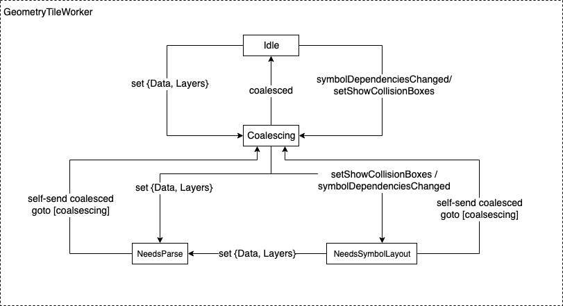

# Geometry Tile Worker

    
*Figure 8: Simplified Geometry Tile Worker State Machine*

Going back to Geometry Tile Worker, it is
a state machine. The main principle is that Geometry Tile Worker should
carry out each task till completion once it has begun even if it
requires asynchronous waiting[^21]. When a Geometry Tile Worker is
working on a task, any new message to said worker is queued. Messages
per *unique tile* are grouped. Upon finishing work, Geometry Tile Worker
picks the latest message from the queue. All changes introduced in the
queued messages are *coalesced* for the next work item for the tile
worker. This way, a Geometry Tile Worker saves itself from starvation
when it is under heavy workload. *Coalescing* also helps at finalizing
the result when all the messages are processed because the map has
stopped moving.

To dive a little bit deeper into this process, let's have a quick look
at Figure 8. It shows a simplified representation of Geometry Tile
Worker state machine. From a cursory look, the state transitions might
not seem self-explanatory. We will take one step at a time to clarify.

*Going forward, this section will use the term **worker** to denote a
**Geometry Tile Worker** for brevity.*

A *worker* is *Idle* when it has nothing to work on or completed
*coalescing* queued messages. It is in *Coalescing* state when it has
not finished processing all the messages in the queue. These two states
are the two key states the *worker* floats between.

The initial transition from *Idle* to *coalescing* starts from a
***set*** message. A worker can receive a **set** message for data or a
layer that is dependent on data. Referring back to **Figure 8**, this is
what the transition label (**set** {Data, Layers} ) from *Idle* to
*Coalescing* state stands for. This initiates an internal workflow named
***Parsing.*** Parsing means understanding the features to be rendered
in a layer. Parsing process is encapsulated in *parse()* method. In the
end of this method, a worker will also deduce required glyphs and images
to render the tile.

A worker will send a message to the Tile it is working on fetching the
necessary glyphs and images. From a threading perspective, it can happen
in the same thread as the worker or in a different thread. Looking back
to Figure 8, we also see another transition path from *Idle* state to
*coalescing* state through *symbolDependenciesChanged* event. When a
tile object is done with downloading pending glyphs and images it issues
a *onImagesAvailable* or *onGlyphsAvailable* event to the worker[^22].
Both of these events will translate to *symbolDependenciesChanged* event
in the end. When *symbolDependenciesChanged* is fired, if the worker is
on *Idle* state, it will move to *Coalescing* state. If the worker was
already working on a tile and *symbolDependenciesChanged* is fired in
the middle, it will move to *NeedsSymbolLayout* state.

## Restart a worker in-progress: NeedsParse and NeedsSymbolLayout state

The logical question to ask right now is why does the worker have
*NeedSymbolLayout* and *NeedsParse* state at all? Based on what we have
seen so far, parsing and fetching symbols (glyphs, images) can be done
in *Coalescing* state. This is to distinguish incremental changes
introduced while the worker is already working on something. This was to
facilitate a reset of current work and force the worker to *parse* and
*fetch* symbols again from the *Coalescing* state. If we look back to
Figure 8 now, we will see that *Coalescing* state goes to
*NeedsSymbolLayout* if a symbol update (glyphs, images) has been
encountered. *NeedsSymbolLayout* state will go to *NeedsParse* state
with a ***set*** method invocation after updating the symbols.
*Coalescing* state will go straight to *NeedsParse* state if only
incremental data or layer change is introduced with a ***set*** method
invocation.

To summarize, restarting an in-progress *worker* requires:

1.  Send *symbolDependenciesChanged* through *onImagesAvailable* or
    *onGlyphsAvailable event.* To re-emphasize, these are not messages
    passed to the worker, rather events invoked through methods.

2.  This will interrupt old parsing process and issue a new ***set***
    method to re-parse data from *NeedsSymbolLayout* or *Coalescing*
    state. In both cases, the worker will end up in *NeedsParse* state
    to re-parse.

*setShowCollisionBoxes* event works in similar fashion. This event is
used to show text label collision boxes in the to-be-rendered tile. It
is used for debugging collision detection of text labels.

## Finalization

A worker finalizes its work when all required data is parsed, and all
symbols are loaded in a layout.

A ***Symbol Layout*** is the process of turning raw features into OpenGL
buffers ready to be rendered. To simplify, a *symbol layout* contains
images, glyphs, and their collision metadata positions relative to the
tile to be rendered.

When a geometry tile worker has completed its work, it moves to *Idle*
state by self-sending *coalesced* transition. Reiterating again, to
consider the worker has coalesced, it has to *parse* all the *coalesced*
data from available messages in the queue for a particular tile.

______________________________________________

[^21]: This is not entirely true. Going forward this section will shed
    some light on *why.* For the time being, the assumption accelerates
    understanding.

[^22]: In reality, *onGlyphsAvailable* and *onImagesAvailable* events
    will be fired from GlyphManager and ImageManger instances. For
    brevity, this document does not speak of these classes.
