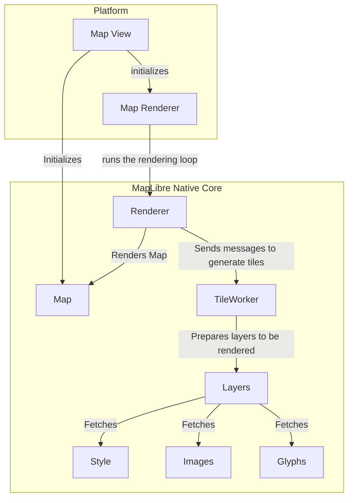

# Ten Thousand Foot View

*Figure 1: MapLibre Native Components – Ten Thousand Foot view*

From ten thousand foot, MapLibre Native is composed of *Map View* and a
*Renderer*. MapLibre Native supports iOS, Android, Linux, QT, MacOS,
and nodeJS at the time of writing. Each of these *platforms* have their
own *Map View* and *Map Renderer* component. A *Map Renderer* talks to a
shared codebase that renders map by using device GPU. This shared piece
of code at the time of writing supports OpenGL as its choice of
rendering API.

Apart from the platform code, *MapLibre Native* offers shared
implementation for *Style, Layers, Text, Glyphs*, and *Tiles*.

To summarize:

1.  ***Map View*** is responsible for viewing a *slippy map,* a term
    referring to web maps which lets a user zoom and pan around. Each
    platform has its own *Map View*.

2.  ***Map Renderer*** is composed of two parts, one is a platform
    specific map rendering loop. The other is a cross-platform renderer
    backend, denoted as *Renderer* in Figure 1.

3.  A *map renderer* uses a ***Tile Worker*** to render individual map
    tile. It uses an ***Actor Framework*** to send messages to a ***Tile
    Worker*** to produce said tiles.

4.  A *tile worker* prepares a tile one layer at a time. A map tile is
    composed of multiple *layers*.

5.  A ***Layer*** requires ***Style***, ***Glyphs***, and ***Sprites***
    for to be ready for rendering. Features rendered in a ***Layer***
    come from data sources. And a ***Layer*** is composed of tiles produced
    from said features.

We will look a bit more into these components going forward[^1].

### Map View

A *Map View* is a reusable map viewer that renders a raster or vector
map in different platform specific viewports. It bears the standard of
common map configuration across the platforms. These ranges from map
viewport size, pixel ratio, tileset URL, style, collision configuration
for text, and annotations[^2]. A *Map View* does not contain any
rendering capability of its own. It publishes and listens to events
through observers[^3].

Figure 1 does not display the explicit use of observers for brevity.

#### Observers

Observers are a group of components that listen and publish events from
and to a *Map View*. Observer come in two major flavours across
platforms -- a *map observer* and a *rendering observer*. A *map
observer* is responsible for handling events for map configuration
changes. This includes events for loading and updating *style*, events
for map becoming idle, events initialization and completion of
rendering, and events for camera orientation changes. On the other hand,
a rendering observer deals with events that are directly related to
frame-by-frame map rendering. A rendering observer might publish a
rendering event to map observers but they are usually rendering
initialization or completion events. One key thing to remember here is a
map configuration can lead to rendering changes such as camera switch,
map center change, viewport size change, zoom, and pitch change.

### Style

Style component embodies a *MapLibre Style Document*. A style document
is a JSON object that defines the visual appearance of a map through the
order to draw it in, what to draw, and how to style the data while
drawing it. Style sub-component is composed of classes and functions
that allows downloading, and configuring a style. A style can be fetched
from a remote HTTP resource or configured locally. The style component
also carries a *Sprite Loader* to load sprites, remote HTTP URL for
glyphs, layers to draw and sources of data to draw. A *sprite* is a
single image that contains all the *icons* included in a style. Layers
are composed of sources where a source could be a vector tile set,
raster tile set, or GeoJSON data

*To complete initialization of a map component, we need to initialize a
map, style with source and layers, and observers.*

### Layer

*Layer* is an overloaded terminology in the MapLibre Native's
context. *Layer* can mean any of the following:

1.  From the point of view of data that needs to be rendered on map,
    each map tile is composed of *layers* of data. Each layer, in this
    context, contains *features*[^4] to be rendered in a map. These
    features are defined by a *source.* Each *layer* is tied to a
    *source*.

2.  From the point of view of *style*, a style's layer property list all
    the *layers* available in that *style*. A single style sheet can be
    applied atop one or many layers. This layer definition converges
    data to be rendered and the style to be applied on said layer.

When this document uses the word layer in context of rendering, it
refers to the definition mentioned in 2.

### Glyphs

A *glyph* is a single representation of a character. A font is a map of
characters[^5]. Map tiles use labels of text to show name of cities,
administrative boundaries, or street names. Map tiles also need to show
icons for amenities like bus stops and parks. A map style uses character
map from fonts to display labels and icons. Collectively these are
called *glyphs.*

*Glyphs* require resizing, rotation, and a halo for clarity in nearly every
interaction with the map. To achieve this, all *glyphs* are pre-rendered
in a shared texture, called *texture atlas*. This atlas is packed inside
protobuf container. Each element of the atlas is an individual texture
representing the SDF of the character to render.

Each *glyph* bitmap inside is a field of floats, named signed distance. It
represents how a *glyph* should be drawn by the GPU. Each *glyph* is of font
size 24 that stores the distance to the next outline in every pixel. Easily
put if the pixel is inside the *glyph* outline it has a value between `192-255`.
Every pixel outside the *glyph* outline has a value between `0-191`. This creates
a black and white atlas of all the *glyphs* inside.

This document currently does not have a dedicated section on text rendering.
When it does, we will dive more into *glyph* rendering.

### Actor Framework

MapLibre Native is used in mobile platforms. To be performant in
underpowered environments, MapLibre Native tries to leverage message
passing across threads to render frames asynchronously. The threading
architecture in implementation realizes this using the Actor
interface[^6]. In reality the messages are raw pointers. This ranges
from raw message to actionable message. By actionable message this
document means *anonymous functions* that are passed as messages between
actors. These arbitrary messages are *immutable* by design. The current
implementation of the Actor framework is done through two major
components, a *MailBox* and an *Actor*. A *MailBox* is attached to a
specific type of *Message*. In the current implementation, these are
rendering events that render layers, sources, and subsequently tiles. An
*Actor* is an independent thread passing messages to others.

### Renderer

A *Map Renderer* translates geospatial features in a vector or raster
tile to rendered or rasterized map tiles shown in a *slippy map.*
MapLibre Native uses a *Renderer* component to translate map tiles
fetched from a tile server to a rendered map.

MapLibre Native uses a pool of *workers*. These workers are
responsible for background tile generation. A render thread continuously
renders the current state of the map with available tiles at the time of
rendering. In Javascript and iOS, the render thread is the same as the
foreground/UI. For performance reasons, Android render thread is
separated from the UI thread. The changes to the map on the UI due to
user interaction is batched together and sent to the render thread for
processing. The platforms also include worker threads for processing for
platform-specific tasks such as running HTTP requests in the background.
But the core code is agnostic about where those tasks get performed.
Each platform is required to provide its own implementation of
concurrency/threading primitives for MapLibre Native core to use. The
platform code is also free to use its own threading model. For example,
Android uses a *GLSurfaceView* with a *GLThread* where the iOS SDK uses
*Grand Central Dispatch* for running asynchronous tasks.

### Tile Worker

We have noted early in this document that MapLibre Native uses message
passing to communicate with the renderer. These messages are *immutable*
by design and the render loops checks for these in each iteration. To
simplify, there is only one thread allocated for rendering loop,
background or foreground[^7]. A *Tile Worker* is a thread that prepares
a tile of a specific type. Geometry Tile Worker by the name of it,
prepares a tile for rendering tiles that contains vector geometry.
Following that same trend, MapLibre Native offers tile worker for
raster tiles and elevation tiles. Messages sent to a tile worker can be
processed by any thread, with the assumption that only one thread at a
time will work with a tile worker instance.

Tile workers are not based on a common interface or base class. Tiles
are. MapLibre Native offers a base Tile class. Raster, Geometry, and
Elevation tile instances are inherited from Tile base class. Through
this inheritance MapLibre Native maintains the association of Tile
types and tile workers. Any Tile Worker is an actor that accepts
messages of a specific Tile type. For a Geometry Tile Worker, the type
is a Geometry Tile.

*To read in depth about the workflow of a Geometry Tile Worker, please
check [Geometry Tile Worker](./geometry-tile-worker.md) chapter.

______________
[^1]: To read in depth about the data flow for map initialization and
    rendering in Android, please check
    [Android Map Rendering Data Flow](./android-map-rendering-data-flow.md)

[^2]: This document speaks of a simplified configuration for brevity.
    These also includes viewport mode, constrain mode, and north
    orientation.

[^3]: Platform SDKs might use a wrapper map view class atop the map
    component. This is to help establish contract between the device
    runtime running a different language. Android is a good example of
    this behaviour.

[^4]: A feature is the spatial description of a real-world entity such
    as a road or a utility pole. Any geometry that is displayed on a map
    tile is either an individual feature or a part of a feature.

[^5]: This document used the term glyph and character interchangeably.
    In reality, a single character can have multiple glyphs. These are
    called alternates. On the other hand, a single glyph can represent
    multiple characters. These are called ligatures.

[^6]: In the Javascript counterpart, MapLibre GL JS, this is achieved
    through usage of webworkers.

[^7]: In iOS, the render thread runs on UI thread, as in it's a
    foreground thread. Android offers wider range of devices in terms of
    battery capacity. Hence, Android prefers to use a background thread
    for rendering loop.
