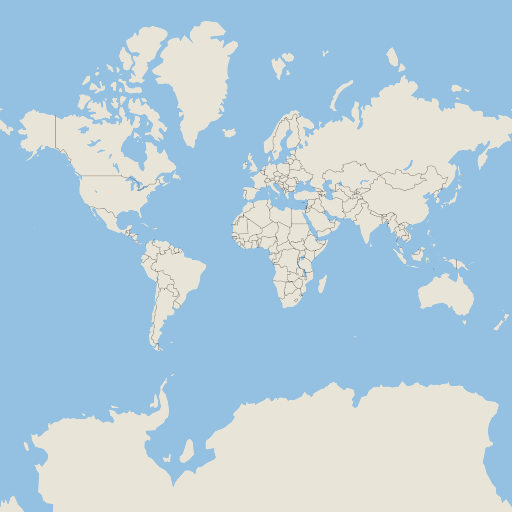

# Linux

This guide explains how to get started building and running MapLibre Native on Linux. The guide focusses on a Ubuntu 22.04 or later. The build process should give you a set of `.a` files that you can use to include MapLibre Native in other C++ projects, as well as a set of executables that you can run to render map tile images and test the project.

## Clone the repo

First, clone the repository. This repository uses [git submodules](https://git-scm.com/book/en/v2/Git-Tools-Submodules), that are required to build the project.

```bash
git clone --recurse-submodules -j8 https://github.com/maplibre/maplibre-native.git
cd maplibre-native
```

## Requirements

```bash
# Install build tools
apt install build-essential clang cmake ccache ninja-build pkg-config

# Install system dependencies
apt install libcurl4-openssl-dev libglfw3-dev libuv1-dev libpng-dev libicu-dev libjpeg-turbo8-dev libwebp-dev xvfb
```

Optional: `libsqlite3-dev` (when not found will use SQLite as vendored dependency).

When using Wayland (now default for `linux-opengl` preset): `libegl1-mesa-dev`.

## Build with CMake

```bash
cmake --preset linux-opengl
cmake --build build-linux-opengl --target mbgl-render
```

## Running `mbgl-render`

Running `mbgl-render --style https://raw.githubusercontent.com/maplibre/demotiles/gh-pages/style.json` should produce a map tile image with the default MapLibre styling from [the MapLibre demo](https://maplibre.org/).


```bash
./build-linux-opengl/bin/mbgl-render --style https://raw.githubusercontent.com/maplibre/demotiles/gh-pages/style.json --output out.png
xdg-open out.png
```

### Headless rendering

If you run `mbgl-render` inside a Docker or on a remote headless server, you will likely get this error because there is no X server running in the container.

> `Error: Failed to open X display.`

You'll need to simulate an X server to do any rendering. Install `xvfb` and `xauth` and run the following command:

```bash
xvfb-run -a ./build-linux-opengl/bin/mbgl-render --style https://raw.githubusercontent.com/maplibre/demotiles/gh-pages/style.json --output out.png
```

### Using your own style/tiles

You can also use the `mbgl-render` command to render images from your own style or tile set. To do so, you will need a data source and a style JSON file.

For the purposes of this exercise, you can use the `zurich_switzerland.mbtiles` from [here](https://github.com/acalcutt/tileserver-gl/releases/download/test_data/zurich_switzerland.mbtiles), and [this](https://gist.github.com/louwers/d7607270cbd6e3faa05222a09bcb8f7d) following `style.json` file. Download both by running the commands below.

```
wget https://github.com/acalcutt/tileserver-gl/releases/download/test_data/zurich_switzerland.mbtiles
wget https://gist.githubusercontent.com/louwers/d7607270cbd6e3faa05222a09bcb8f7d/raw/4e9532e1760717865df8aeff08f9bcf100f9e8c4/style.json
```

Note that this style is totally inadequate for any real use beyond testing your custom setup. Replace the source URL `mbtiles:///path/to/zurich_switzerland.mbtiles` with the actual path to your `.mbtiles` file. You can use this command if you downloaded both files to the working directory:

```bash
sed -i "s#/path/to#$PWD#" style.json
```

Next, run the following command.

```bash
./build-linux-opengl/bin/mbgl-render --style style.json --output out.png
```

This should produce an `out.png` image in your current directory with a barebones image of the world.



### Running the render tests

> [!TIP]
> For more information on the render tests see the [dedicated Render Tests article](../../render-tests.md).

To check that the output of the rendering is correct, we compare actual rendered PNGs for simple styles with expected PNGs. The content of the tests used to be stored in the MapLibre GL JS repository, which means that GL JS and Native are mostly pixel-identical in their rendering.

The directory structure of the render tests looks like:

```
metrics/
  integration/
    render-tests/
      <name-of-style-spec-feature>/
        <name-of-feature-value>/
          expected.png
          style.json
```

After the render test run, the folder will also contain an `actual.png` file and a `diff.png` which is the difference between the expected and the actual image. There is a pixel difference threshold value which is used to decide if a render test passed or failed.


Run all render tests with:

```
./build-linux-opengl/mbgl-render-test-runner --manifestPath metrics/linux-clang8-release-style.json
```

Or a single test with:

```
./build-linux-opengl/mbgl-render-test-runner --manifestPath metrics/linux-clang8-release-style.json --filter "render-tests/fill-visibility/visible"
```

The render test results are summarized in a HTML website located next to the manifest file. For example, running `metrics/linux-clang8-release-style.json` produces a summary at `metrics/linux-clang8-release-style.html`.
