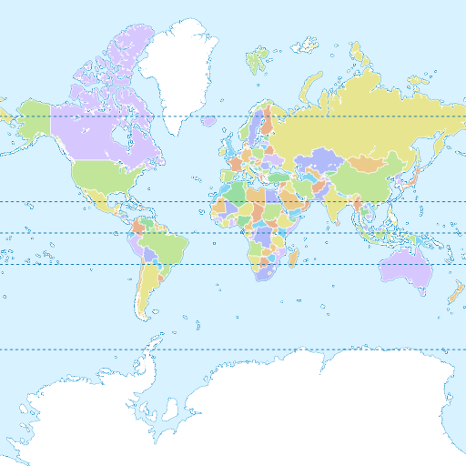

# Building with MSYS2

## Prerequisites

You must have [`MSYS2`](https://www.msys2.org/) installed. Then launch an  window, which can be `UCRT64`, `CLANG64`, `CLANGARM64` or `MINGW64`.

You need to install the required packages:

```sh
pacman -S --needed \
    git \
    ${MINGW_PACKAGE_PREFIX}-toolchain \
    ${MINGW_PACKAGE_PREFIX}-clang \
    ${MINGW_PACKAGE_PREFIX}-cmake \
    ${MINGW_PACKAGE_PREFIX}-angleproject \
    ${MINGW_PACKAGE_PREFIX}-curl-winssl \
    ${MINGW_PACKAGE_PREFIX}-dlfcn \
    ${MINGW_PACKAGE_PREFIX}-glfw \
    ${MINGW_PACKAGE_PREFIX}-icu \
    ${MINGW_PACKAGE_PREFIX}-libjpeg-turbo \
    ${MINGW_PACKAGE_PREFIX}-libpng \
    ${MINGW_PACKAGE_PREFIX}-libwebp \
    ${MINGW_PACKAGE_PREFIX}-libuv
```

Then everything is ready to start.

## Downloading sources

Just clone the repository:

```sh
git clone --depth 1 --recurse-submodules -j8 https://github.com/maplibre/maplibre-native.git
cd maplibre-native
```

## Configuring

Configure the build with the following command, replacing `<preset>` with `opengl`, `egl` or `vulkan`, which are the rendering engines you can use. If you don't know which one to choose, just use `opengl`:

```sh
cmake --preset windows-<preset> -DCMAKE_C_COMPILER=clang -DCMAKE_CXX_COMPILER=clang++
```

## Building

Finally, build the project with the following command, again replacing `<preset>` with the value you choose in the configure step:

```sh
cmake --build build-windows-<preset>
```

## Testing

If all went well and target `mbgl-render` or `ALL_BUILD` was chosen, there should now be a `build-windows-<preset>/bin/mbgl-render.exe` binary that you can run to generate map tile images. To test that it is working properly, run the following command.

```sh
./build-windows-<preset>/bin/mbgl-render.exe --style https://raw.githubusercontent.com/maplibre/demotiles/gh-pages/style.json --output out.png
```

This should produce an `out.png` map tile image with the default MapLibre styling from [the MapLibre demo](https://maplibre.org/maplibre-gl-js/docs/examples/display-a-map/).



### Using your own style/tiles

You can also use the `mbgl-render` command to render images from your own style or tile set. To do so, you will need a data source and a style JSON file.

For the purposes of this exercise, you can use the `zurich_switzerland.mbtiles` from [here](https://github.com/acalcutt/tileserver-gl/releases/download/test_data/zurich_switzerland.mbtiles), and the following `style.json` file.

```json
{
  "version": 8,
  "name": "Test style",
  "center": [
    8.54806714892635,
    47.37180823552663
  ],
  "sources": {
    "test": {
      "type": "vector",
      "url": "mbtiles:///path/to/zurich_switzerland.mbtiles"
    }
  },
  "layers": [
    {
      "id": "background",
      "type": "background",
      "paint": {
        "background-color": "hsl(47, 26%, 88%)"
      }
    },
    {
      "id": "water",
      "type": "fill",
      "source": "test",
      "source-layer": "water",
      "filter": [
        "==",
        "$type",
        "Polygon"
      ],
      "paint": {
        "fill-color": "hsl(205, 56%, 73%)"
      }
    },
    {
      "id": "admin_country",
      "type": "line",
      "source": "test",
      "source-layer": "boundary",
      "filter": [
        "all",
        [
          "<=",
          "admin_level",
          2
        ],
        [
          "==",
          "$type",
          "LineString"
        ]
      ],
      "layout": {
        "line-cap": "round",
        "line-join": "round"
      },
      "paint": {
        "line-color": "hsla(0, 8%, 22%, 0.51)",
        "line-width": {
          "base": 1.3,
          "stops": [
            [
              3,
              0.5
            ],
            [
              22,
              15
            ]
          ]
        }
      }
    }
  ]
}
```

Note that this style is totally inadequate for any real use beyond testing your custom setup. Don't forget to replace the source URL `"mbtiles:///path/to/zurich_switzerland.mbtiles"` with the actual path to your mbtiles file.

From your `maplibre-native/` dir, run the following command.

```sh
./build-windows-<preset>/bin/mbgl-render.exe --style path/to/style.json --output out.png
```

This should produce an `out.png` image in your current directory with a barebones image of the world.


