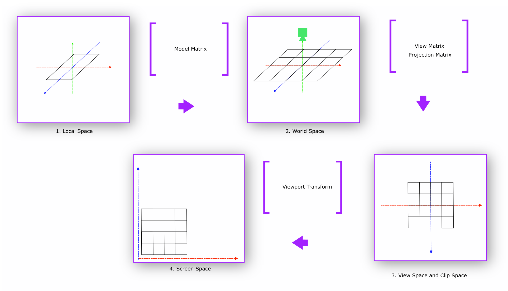

# Coordinate System

Before we jump into the coordinate system of MapLibre Native GL, let's
quickly review the concepts of translating a position on the face of
Earth to a map tile. This is not a comprehensive refresher of coordinate
reference systems or rendering basics. Rather this intends to guide the
reader on what we want to achieve in this section.

We start from *Earth*, which is a geoid which is mathematically
expensive to use as a reference coordinate system. Thus, we approximate
the earth to reference ellipsoids or datum. For this documents' scope,
WGS84 is used as the canonical datum. Our goal is to represent
geometries defined by WGS84 longitude, latitude pair coordinates to a
map tile.

Instead of translating a full geometry, in the following subsections, we
will project a WGS 84 point to a map tile rendered in MapLibre GL
Native.

#### World vs Earth

This document uses the word *Earth* when it refers to the planet in
which we all live in and make map tiles for. This document uses the word
*World* to denote the world MapLibre Native GL renders. The word *world*
in rendering terms mean the *world* to render. It could be a set of
cones and boxes, a modeled city, anything composed of 3D objects.
MapLibre GL Native renders map tiles in a range of zoom levels on a 3D
plane. Map tiles are already produced from a WGS84 ellipsoid. Therefore,
when this document uses the word *World,* it means the 3D plane
containing a set of map tiles to be rendered, not the *Earth*.

#### Transformations

MapLibre GL requires a series of coordinate transformations to render a
geometry from map tile. This is where we refresh our rendering knowledge
a bit. To render anything through a GPU:

1.  Design and define model in the *Local Space*. We call anything that
    needs to be renderer a *model.* In the Local space, a model lives in
    its own coordinate system. For MapLibre Native GL, in local space
    each individual tile is modeled. This map tile is already populated
    by a map tile generation process. The longitude, latitude bound per
    tile is now translated to pixel bounds in this local space.

2.  When model matrix is applied to local space, as in a camera is
    applied, *Local Space* transforms to *World Space*. In this space,
    the model coordinates are relative to the world's origin. In this
    space all the individual map tiles to be rendered are introduced in
    the world space.

3.  The *World Space* is not seen from a viewpoint of a camera. When we
    see the *world* from a viewpoint of a camera, view matrix
    transformation is applied. Cameras can see the world up to a
    distance like human eyes can. To emulate that we apply *Projection
    Matrix* to *View Space* and end up in *Clip Space*[^8].

4.  Finally, the *World Space* is transformed to device screen by
    applying viewport transform matrix.

Going forward, scoping our discussion only to MapLibre GL Native, we
will talk mostly about two categories of coordinate systems:

1.  World Coordinates

2.  Device Coordinates

World Coordinates are defined in *World Space*. This speaks of how *this
world defines itself in a three-dimensional space*.[^9] On the other
hand, device coordinates are used through View, Clip, and Screen Space.
The purpose of this set of coordinates is to define how the world will
be projected on a screen. Device Coordinates define *how a world will be
projected on a screen.*

The unit of measurement will be pixels in this document. When the map
tiles are generated by a system, the unit of distance in each tile is
measured in degree angles instead of meters. Because angular distance
stays the same if we move the angle across the axis of earth.

Figure 2 shows rendering map tile through the rendering spaces and
transformations below:

   
*Figure 2: Rendering Spaces and Transformations for Map Tiles*

## World Coordinates

World Coordinates for maps start with *Geographic Coordinate Systems*.
*Geographic Coordinate Systems* use the three-dimensional model of the
earth (ellipsoid) to define specific locations on the surface to create
a grid. Traditional longitude, and latitude coordinate pair to define a
location is an example of using geographic coordinates. EPSG: 4326
(WGS84) is the reference *Geographic Coordinate System* that most of the
world's geospatial data is defined and stored[^10] in. There is no way
to visualize the WGS84 coordinate system on a two-dimensional plane, in
this case, the map.

Projections are used to translate WGS84 coordinates to a plane. To be
specific, projections are used to translate a location on the ellipsoid
to a two-dimensional square. EPSG:3857[^11] or projected
*Pseudo-Mercator Coordinate System* is such a coordinate system.
EPSG:3857 is used by MapLibre GL Native as a default coordinate system
to display maps. This system takes WGS84 coordinates and projects them
into sphere. This stretches out the landmass in the hemispheres but
mathematically makes it simpler to project a location back to a 2D
plane. As in, a sphere divided into angular equidistant grid produces
rectangular grids when projected into a 2D plane. The philosophy behind
this was to make rendering maps easy, as in drawing 2D squares on a
plane is computationally trivial.

Our world can be now broken down into these squares or tiles as we will
call it going forward. This system imagines the world as a giant grid of
tiles. Each tile has a fixed size defined in pixels.

```
worldSize = tileSize * number of tiles across a single dimension
```

For brevity, this document assumes the reader knows that map tiles are
divided into a range of zoom levels. And each tile in zoom N gets
divided into 4 tiles in zoom N+1. A tile size of 512 pixels and zoom
level 11 will deduce *worldSize* to be the following:

```
worldSize = 512 * 2^11 = 1048576
```

Although each tile breaks into 4 in the next zoom level, we used a power
of 2. This is because X and Y both dimensions expand with a factor of 2.

Example: We start from translating a WGS84 location with longitude
-77.035915 and latitude 38.889814. To translate a degree longitude
relies on normalizing the latitude range `[-180, 180]` to `[0,
1048576]`. This means the X pixel value of a specific tile requires
shifting our coordinate by 180. For example, a location with longitude
-77.035915 becomes*:*

```
X = (180 + longitude) / 360 * worldSize
= (180 + -77.035915) / 360 * 1048576
= 299,904
```

Finding the X coordinate is easy to compute. But the Y requires a more
than normalizing the range. This is due to the aforementioned space
stretching in the hemispheres[^12]. Latitude value (Y) defined in WGS84
will not be the same position after stretching. The computation looks
like the following if the latitude was 38.889814:

```
y = ln(tan(45 + latitude / 2))
= ln(tan(45 + 38.889814/ 2))
= 0.73781742861
```

Now, to compute the pixel value for y:

```
Y = (180 - y * (180 / π)) / 360 * worldSize
= (180 - 42.27382˚) / 360 * 1048576
= 401,156
```

### Tile Coordinates

Our next pursuit is to translate *World Coordinates to Tile
Coordinates*. Because we want to know where exactly inside a map tile a
location (longitude, latitude) coordinate gets rendered and vice versa.
This system creates different pixel ranges per zoom level. So, we append
the zoom level along with the X and Y pixel values. Dividing the pixel
values with the tile size normalizes the X and Y value *per tile*. This
means `(x:299,904, y:401,156, z:11)` becomes `(585.7471, 783.5067, z11)`.

We divide our X and Y pixel value by tile size because we want to know
the starting coordinates of each tile instead of individual location
coordinates. This helps in drawing a tile. If we now *floor* the
components to integers, we get `(585/783/11)`. This marks an individual
tile's X, Y, and Z.

To reach our goal of translating a location to a coordinate inside a
tile, we need to know what is the *extent* of the tile. MapLibre GL
Native follows Mapbox Vector Tile (MVT) spec. Following said spec,
MapLibre GL Native internally normalizes each tile to an *extent* of
8192. Tile extent describes the width and height of the tile in integer
coordinates. This means a tile coordinate can have higher precision than
a pixel. Because normally a tile has a height and width of 512 pixels.
In this case, with an extent of 8192, each ***Tile Coordinate*** has a
precision of `512/8192 = 1/16`th of a pixel. Tile *extent* origin (0,0)
is on top left corner of the tile, and the (Xmax, Ymax) is on the bottom
right. This means (8192, 8192) *tile coordinate* will be in the bottom
right. Any coordinate greater or lesser than the *extent* range is
considered outside the *extent* of the tile. Geometries that extend past
the tile's area as defined by the extent are often used as a *buffer*
for rendering features that overlap multiple adjacent tiles.

To finally deduce the ***Tile Coordinates*** we multiply the remainder
of our Tile components with *extent:*

```
(585.7471, 783.5067, z11) -> (.7471 * 8192, .5067 * 8192) = (x:
6120, y: 4151)
```

This makes the ***Tile*** to be `(585/783/11)` and ***Tile Coordinates***
to be `(x: 6120, y: 4151)` for WGS84 location with longitude -77.035915,
and latitude 38.889814.

After defining ***Tile Coordinates***, our pursuit continues to
translate these coordinates to native device coordinates. To reiterate
our progress in the perspective of rendering, we just defined our local
space with tile coordinates. Local coordinates are the coordinates of
the object to be rendered relative to its local origin[^13]. In this
case, the objects are the map tiles. The next step in traditional
rendering workflow is to translate object coordinates to world
coordinates. This is important to understand if we are to render
multiple objects in the world. If we treat all tiles in a zoom level
being rendered in a single 3D horizontal plane, then the World Space has
only one object. And in MapLibre GL, this plane has an origin of (0,0),
positioned on the top left.

## Device Coordinates

World space for MapLibre GL Native contains a plane in 3D with all the
tiles for any specific zoom level. Map tiles are hierarchical in nature.
As in they have different zoom levels. MapLibre GL Native internally
stores a tree object that mimics a tile pyramid. However, it does not
create a hierarchy of 3D planes where each plane mimics one zoom level.
It reuses the same 3D plane to re-render the tiles in the requested zoom
level at a time.

The journey towards rendering the tiles in the device screen from the
world space starts with *View Matrix*, as defined in the world space.
The key part here is the *camera*. A *view matrix* is a matrix that
scales, rotates, and translates[^14] the world space from the view of
the camera. To add the perspective of the camera, we apply the
*Projection Matrix*. In MapLibre GL Native, a camera initialization
requires map center, bearing, and pitch.

*Initializing the map with a center (lon, lat) does not translate or
move the 3D plane with tiles, rather moves the camera atop the defined
position named center. In the rendering world, this is not the center of
the 3D plane we render tiles on, rather the position of the camera.*

    
*Figure 3: Perspective Frustum (Sourced from learnopengl.com)*

The benefit of tile coordinates continues here. The camera representation 
we use here, to be specific the view matrix, can directly take the tile 
coordinates to move the camera to a particular tile in a zoom level. 
Once a tile is built, the GPU can quickly draw the same tile with different 
bearing, pan, pitch, and zoom parameters[^15].

If we keep following Figure 2, we see we need to also add a projection
matrix. And MapLibre GL Native uses a *perspective projection*.
Perspective projection matrix introduces the sense of depth perspective
through the camera. As in objects further from the camera will look
smaller and objects closer to the camera will look bigger. This
perspective component is defined by parameter *w.* That is why the
shaders that MapLibre Native GL at the time of writing uses 4
dimensional vectors over 3 dimensional vectors. The 4^th^ dimension is
this parameter *w*. Therefore, theoretically a GL coordinate is of the
form `(x, y, z, w)`.

Before we jump into the transformations, let's revisit an example
scenario:

```
zoom: 11.6
map center: (38.891, -77.0822)
bearing: -23.2 degrees
pitch: 45 degrees
tile: 585/783/11
```

On top of this, MapLibre GL Native uses a field of view of 36.87 degrees
or 0.6435011087932844 radians. This is somewhat arbitrary. The altitude
of the camera used to be defined as 1.5 screen heights above the ground.
The ground is the 3D plane that paints the map tiles. The field of view
is derived from the following formula:

```
fov = 2 * arctan((height / 2) / (height * 1.5))
```

Factoring only the transformations of zoom, map center, bearing, pitch,
and tile in, with a viewport of 862 by 742 pixels, the projection matrix
will look like[^16]:

|      |  **x**                 |  **y**       |  **z**       |  **w**      |
|------| -----------------------|--------------|--------------|-------------|
| **x**|  0.224                 |  -0.079      |   -0.026     |    -0.026   |
| **y**|   -0.096               |  -0.184      |  -0.062      |   -0.061    |
| **z**|   0.000                |   0.108      |   -0.036     |   -0.036    |
| **w**|  -503.244              | 1071.633     | 1469.955     | 1470.211    |

To use our *tile coordinates,* we will turn it to a 4D vector of
(x,y,z,w) with neutral w value 1. For brevity we used z value of 0. For
buildings and extrusions z value will not be 0. But this document does
not cover that.

So, tile coordinate `(x: 6120, y: 4151, z:0, w:1)` will transform to the
following due to a vector multiplication with the projection matrix:

|                  |**x**                           |**y**                      |**z**                     |**w**                    |
|------------------|--------------------------------|---------------------------|--------------------------|-------------------------|
| **x = 6120**     |  0.2240.224 * 6120 = 1370.88   |  -0.079 * 6120 = -483.48  | -0.026 * 6120 = -159.12  | -0.026 * 6120 = -159.12 |
| **z = 4151**     |  -0.096 * 4151 = -398.496      |  -0.184 * 4151 = -763.784 | -0.062 * 4151 = -257.362 | -0.061 * 4151 = 253.311 |
| **z = 0**        |  0.000 * 0 = 0                 |  0.108 * 0 = 0            | -0.036 * 0 = 0           | -0.036 * 0 = 0          |
| **w = 1**        |  -503.244 * 1 = -503.244       |  1071.633 * 1 = 1071.633  | 1469.955 * 1 = 1469.955  | 1470.211 * 1 = 1470.211 |
| **Final Vector** |  469.14                        |  -175.631                 | 1053.473                 | 1057.78                 |

The finalized vector is off from what we have expected with the result
from the simulation. This is due to multiplying with low precision.

The final vector will be `(x: 472.1721, y: -177.8471, z: 1052.9670, w:
1053.7176)`. This is not perspective normalized. Perspective
normalization happens when we divide all the components of this vector
with perspective component *w*.

```
(472.1721 / 1053.72, -177.8471 / 1053.72, 1052.9670 / 1053.72)
= (x: 0.4481, y: -0.1688, z: 0.9993)
```

Doing this will take us into *clip space.* Clip coordinates contain all
the tile coordinates we wish to render in MapLibre GL Native but only in
a normalized coordinate space of `[-1.0, 1.0]`.

All that is left now is to translate this to viewport coordinates.
Following Figure 2, we use *viewport transform* to produce these
coordinates:

```
Pixel Coordinates: (NormalizedX * width + width / 2, height / 2 -
NormalizedY * height)
 = (0.4481 * 862 + 431, 371 - (-0.1688 * 742))
 = (x: 624, y: 434)
```

These are our viewport screen coordinates where our desired WGS84
location longitude -77.035915 and latitude 38.889814 will be rendered.
_________________________
[^8]: Clip coordinates are normalized to -1.0 to 1.0. For brevity, this
    document does not dive deep into 3D rendering basics.

[^9]: For brevity, this document is assuming the world we live in is
    three dimensional.

[^10]: For brevity, this document does not dive deep into reference
    ellipsoids to approximates earth, also known as Datums. EPSG:4326 or
    WGS84 is such a Datum or reference ellipsoid.

[^11]: There are other coordinate systems such as EPSG:54001 that uses
    equirectangles over squares to project the WGS84 coordinates. This
    document focuses on EPSG:3857 because MapLibre GL Native uses it by
    default.

[^12]: This document scopes out the trigonometric proof of this
    translation for brevity. To know more:
    <https://en.wikipedia.org/wiki/Web_Mercator_projection>

[^13]: For brevity, this document does not speak in depth of rendering
    basics in regards to coordinate systems. For more, please check:
    <https://learnopengl.com/Getting-started/Coordinate-Systems>

[^14]: Scale, rotate, and translate are common rendering transformation
    used to produce model, view, and projection matrices. These
    operations are applied right to left. As in translate first, rotate
    second, and scale last. Matrix multiplications are not commutative,
    so order of operation matters.

[^15]: The piece of code we run on GPU is called a shader. We will see
    more how shaders influence MapLibre GL Native rendering later in the
    document.

[^16]: Matrix and examples produced from Chris Loers work hosted in:
    <https://chrisloer.githuba.io/mapbox-gl-coordinates/#11.8/38.895/-77.0757/40/60>
